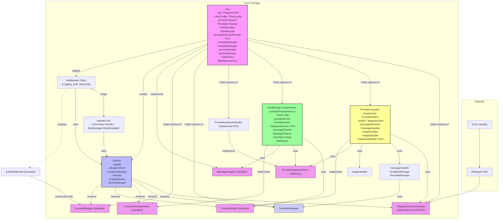

# Teleflow Core Package Architecture Review (Post-Refactoring Phase 1)

**Date:** June 9, 2025
**Version:** Post-Task Groups 1-7 & `flowManager` Concurrency Fix

## 1. Introduction

This document provides an overview of the current architecture of the `teleflow.core` package after the initial phase of refactoring (covering Task Groups 1-7 as per `docs/comprehensive_refactoring_plan.md`, and an ad-hoc `flowManager` concurrency fix). It also includes comments on potential further actions and improvements.

The primary goals of this refactoring phase were to enhance maintainability, improve testability, promote clean code, maintain a stable user API, and increase internal automation.

## 2. Core Components and Their Responsibilities

The `core` package is structured around several key components and interfaces:

*   **`Bot` (`core/bot.go`)**:
    *   The central orchestrator of the bot.
    *   Initializes and holds instances of core services (API client, prompt composer, flow manager, etc.).
    *   Manages middleware.
    *   Processes incoming updates and dispatches them to appropriate handlers.
    *   Implements `MessageCleaner` for message deletion/editing.
    *   Depends on: `TelegramClient`, `FlowConfig`, `PromptComposer`, `PromptKeyboardActions`, `TemplateManager`, `AccessManager`.

*   **`TelegramClient` (interface - `core/telegram_client.go`)**:
    *   An abstraction for all direct interactions with the Telegram Bot API.
    *   Methods: `Send`, `Request`, `GetUpdatesChan`, `GetMe`.
    *   Implemented by `APIClient` (which wraps `tgbotapi.BotAPI`), and mocked by `TestableBotAPI` in tests.

*   **`PromptComposer` (`core/prompt_composer.go`)**:
    *   Responsible for constructing and sending complex messages (prompts), potentially including text, images, and keyboards.
    *   Implements `PromptSender`.
    *   Depends on: `TelegramClient`, `messageHandler`, `imageHandler`, `PromptKeyboardActions`.

    *   **`messageHandler` (`core/prompt_message_handler.go`)**:
        *   Handles rendering of message text, primarily using templates.
        *   Depends on: `TemplateManager`.
    *   **`imageHandler` (`core/prompt_image_handler.go`)**:
        *   Processes `ImageSpec` to prepare images for sending. Self-contained.
    *   **`PromptKeyboardHandler` (`core/prompt_keyboard_handler.go`)**:
        *   Manages the creation and callback data handling for inline keyboards associated with prompts.
        *   Implements `PromptKeyboardActions`.

*   **`flowManager` (`core/flow.go`)**:
    *   Manages multi-step conversation flows.
    *   Tracks user state within flows.
    *   Handles transitions between flow steps.
    *   Implements `ContextFlowOperations`.
    *   Depends on: `FlowConfig`, `PromptSender`, `PromptKeyboardActions`, `MessageCleaner`.
    *   Contains `muUserFlows (sync.RWMutex)` for concurrent access to `userFlows` map.

*   **`Context` (`core/context.go`)**:
    *   A request-scoped object holding information about the current update and providing helper methods for handlers and middleware.
    *   **No longer holds a direct `*Bot` pointer for most operations.**
    *   Depends on (injected at creation): `tgbotapi.Update`, `TelegramClient`, `TemplateManager`, `ContextFlowOperations`, `PromptSender`, `AccessManager`.

*   **`TemplateManager` (interface/struct - `core/template_manager.go`, `core/templates.go`)**:
    *   Manages parsing, caching, and rendering of message templates (e.g., Go templates).
    *   `Bot` holds an instance, which is then passed to `messageHandler` and `Context`.

*   **Middleware System (`core/middleware_types.go`, `core/bot.go`, `core/middleware.go`)**:
    *   `HandlerFunc`: `func(ctx *Context) error` - type for actual request handlers.
    *   `MiddlewareFunc`: `func(next HandlerFunc) HandlerFunc` - type for middleware.
    *   `Bot` registers and applies middleware to handlers.
    *   Specific middlewares (e.g., `LoggingMiddleware`, `AuthMiddleware`) implement `MiddlewareFunc` and use `Context` methods. `AuthMiddleware` takes `AccessManager` via its own constructor.

*   **`AccessManager` (interface - likely `core/access_manager.go` or `core/interfaces.go`)**:
    *   Handles permission checking and access control.
    *   An instance is held by `Bot` and passed to `Context` and `AuthMiddleware`.

*   **Shared Interfaces (`core/interfaces.go`)**:
    *   A central place for some newly defined interfaces like `PromptSender`, `MessageCleaner`, `ContextFlowOperations`. Other interfaces like `TelegramClient` and `PromptKeyboardActions` are defined closer to their primary implementation/consumer.

## 3. Key Interactions and Data Flow (Conceptual)

A typical update processing flow:

1.  **Update Reception**: `Bot.Start()` launches a goroutine that receives `tgbotapi.Update` objects from the `TelegramClient.GetUpdatesChan()`.
2.  **Context Creation**: For each update, `Bot.processUpdate()` creates a new `Context` instance. Crucially, it injects specific dependencies into the `Context` (e.g., `bot.api` as `TelegramClient`, `bot.templateManager`, `bot.flowManager` as `ContextFlowOperations`, `bot.promptComposer` as `PromptSender`, `bot.accessManager`).
3.  **Middleware Execution**: The `Context` and a base handler (e.g., a command handler or `flowManager.HandleUpdate`) are passed through the `Bot`'s registered middleware chain via `Bot.applyMiddleware()`. Each middleware can act on the `Context` or modify the request/response flow.
4.  **Handler Execution**: The final handler (e.g., command handler, `flowManager.HandleUpdate`) is executed with the `Context`.
    *   **Command Handlers**: Use `Context` methods to get arguments, send replies (via `Context`'s `TelegramClient`), manage flow data (via `Context`'s `ContextFlowOperations`), etc.
    *   **`flowManager.HandleUpdate`**: Uses its injected `PromptSender` (implemented by `PromptComposer`), `PromptKeyboardActions`, and `MessageCleaner` (implemented by `Bot`) to manage flow steps, send prompts, and clean up messages. It uses `Context` to access update details and user/chat IDs.
5.  **Sending Responses**:
    *   `PromptComposer` (when called by `flowManager` or directly via `Context.SendPrompt`) uses its `TelegramClient` to send messages.
    *   `Context` helper methods (e.g., `sendSimpleText`) use the `Context`'s injected `TelegramClient`.
    *   `Bot` methods (implementing `MessageCleaner`) use the `Bot`'s `TelegramClient`.

**Visualizing Component Relationships:**

*(Note: This Mermaid diagram aims to show key dependencies and flow. It can be rendered by tools/platforms that support Mermaid syntax.)*

## 4. Review of Refactoring Goals

The refactoring efforts have substantially met the initial goals:
*   **Enhanced Maintainability:** Achieved through DI, interfaces, and decoupling.
*   **Improved Testability:** Achieved through mockable dependencies and component isolation.
*   **Clean Code:** Progress made through better SRP, readability, and reduced global state.
*   **Stable User API Surface:** Achieved, with `NewBot` becoming more extensible.
*   **Increased Automation (Internal):** Achieved in dependency resolution and context data flow.
*   **No Backward Compatibility Constraint (Internal):** Correctly utilized for deep refactoring.

## 5. Further Actions / Recommendations

While significant progress has been made, the following actions are recommended:

### A. Immediate / High Priority (Next Steps)

1.  **Comprehensive Testing (Task Group 8):**
    *   **Unit Tests:** Write thorough unit tests for all refactored components, leveraging the new ability to mock dependencies:
        *   `Bot` (with mock `TelegramClient`, mock handlers).
        *   `PromptComposer` (with mock `TelegramClient`, `messageHandler`, `imageHandler`, `PromptKeyboardActions`).
        *   `messageHandler` (with mock `TemplateManager`).
        *   `flowManager` (with mock `PromptSender`, `PromptKeyboardActions`, `MessageCleaner`). Test flow logic, step transitions, data handling, and concurrency safety.
        *   `Context` (test helper methods with mock dependencies).
        *   Individual Middleware functions.
    *   **Integration Tests:** Create integration tests for key end-to-end scenarios:
        *   Processing a simple command.
        *   Executing a multi-step flow, including message sending, keyboard interactions, and data persistence within the flow.
        *   Middleware interactions (e.g., auth blocking/allowing a request).

### B. Documentation & Cleanup (Task Group 9)

1.  **Godoc:** Update or add Godoc comments for all public types, functions, methods, and interfaces that were added or modified. Explain their purpose, parameters, and return values.
2.  **Internal Comments:** Review and update internal comments to reflect the new architecture and logic.
3.  **README/Developer Guides:** Update any `README.md` files or internal developer documentation that describes the `core` package architecture, component responsibilities, or how to extend/use the system.
4.  **Code Cleanup:** Perform a general code review for any remaining dead code, TODOs that can now be addressed, or minor stylistic improvements.

### C. Potential Future Enhancements & Considerations (Beyond Current Plan)

1.  **Configuration Management:**
    *   Review how configurations (`BotConfig`, `FlowConfig`, API tokens, etc.) are loaded and managed. Consider options for more flexible loading (e.g., from YAML/JSON files, environment variables) to complement programmatic configuration.

2.  **Standardized Error Handling:**
    *   Define a more standardized approach to error types and error handling/wrapping across the `core` package to improve debugging and error reporting.

3.  **Centralized & Configurable Logging:**
    *   While `LoggingMiddleware` exists, a more holistic and configurable logging strategy for the entire `core` package (and potentially the bot application) could be beneficial, allowing different log levels and outputs.

4.  **`BotOption` for `TemplateManager`:**
    *   As noted during TG5, allow a custom `TemplateManager` instance to be passed to `NewBot` via a `BotOption`. This would provide more flexibility for users with advanced templating needs.

5.  **Review `AccessManager` Design:**
    *   Once `AuthMiddleware` and `AccessManager` are more heavily used or tested, review if the `AccessManager` interface and its integration are optimal or if refinements are needed.

6.  **Fine-tune `ContextFlowOperations` Interface:**
    *   The `ContextFlowOperations` interface currently mirrors methods on `flowManager`. Review if this is the most optimal interface for `Context` users, or if `Context` should expose even more specific, use-case-driven methods that internally call the necessary `flowManager` operations. The current approach is functional but could be refined for stricter interface segregation if deemed necessary.

7.  **Asynchronous Operations & Graceful Shutdown:**
    *   Consider patterns for handling long-running asynchronous operations initiated by handlers/middleware and ensuring graceful shutdown of the bot, allowing pending operations to complete.

This review and architectural overview should provide a good snapshot of the current state and a roadmap for the next phases.