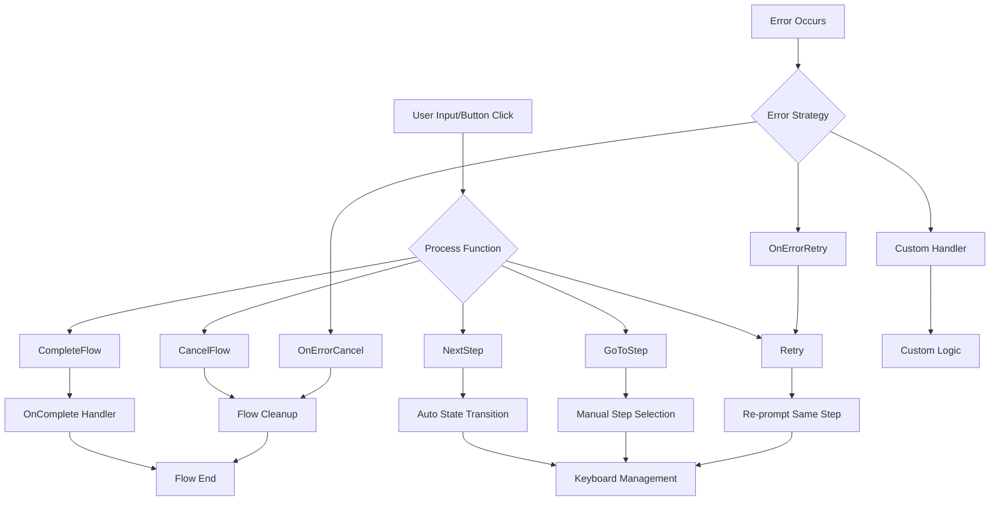

# TeleFlow Enterprise Bot API Guide

> **Quick Start for Go Developers**: Enterprise-grade Telegram bot framework with fluent flows, automatic state management, and type-safe interactions.

## 🚀 Quick Overview

TeleFlow is an enterprise Telegram bot framework that eliminates boilerplate and complexity:

- **Fluent Flow Architecture**: Define conversational flows with automatic state management
- **Type-Safe Callbacks**: Use `interface{}` for rich callback data - framework handles Telegram's string-only limitation transparently
- **Zero-Config State Management**: Automatic user session handling and data persistence
- **Enterprise Middleware Stack**: Built-in rate limiting, authentication, and data isolation
- **Advanced Templates**: MarkdownV2 support with data precedence and auto-escaping
- **Smart UI Management**: Configurable message/keyboard cleanup strategies

## 🏗️ Basic Bot Setup

### Minimal Bot
```go
import teleflow "github.com/kslamph/teleflow/core"

// Basic initialization
bot, err := teleflow.NewBot(os.Getenv("TELEGRAM_BOT_TOKEN"))
if err != nil {
    log.Fatal(err)
}

// Simple message handler
bot.HandleCommand("start", func(ctx *teleflow.Context, command string, args string) error {
    return ctx.SendPromptText("Welcome to TeleFlow!")
})

bot.Start()
```

### Enterprise Bot with Security
```go
// Access manager for enterprise features
type EnterpriseAccessManager struct {
    mainMenu *teleflow.ReplyKeyboard
}

func (m *EnterpriseAccessManager) CheckPermission(ctx *teleflow.PermissionContext) error {
    // Your permission logic here
    return nil
}

func (m *EnterpriseAccessManager) GetReplyKeyboard(ctx *teleflow.PermissionContext) *teleflow.ReplyKeyboard {
    return m.mainMenu
}

// Enterprise bot with automatic middleware stack
bot, err := teleflow.NewBot(token,
    teleflow.WithFlowConfig(teleflow.FlowConfig{
        ExitCommands:        []string{"/cancel", "/exit"},
        ExitMessage:         "🚫 Operation cancelled",
        AllowGlobalCommands: false,
    }),
    teleflow.WithAccessManager(accessManager), // Auto-applies rate limiting + auth
)
```

## 📡 Advanced Messaging

### Simple Messaging
```go
// Simple text only
ctx.SendPromptText("Hello World")
```

### Prompt Builder Pattern
```go
// Rich message with image and template
imageBytes, _ := generateWelcomeImage(user.Name)

return ctx.SendPrompt(&teleflow.PromptConfig{
    Message:      "template:welcome_user",
    Image:        imageBytes,
    TemplateData: map[string]interface{}{
        "UserName": user.Name,
        "UserID":   ctx.UserID(),
        "JoinDate": time.Now().Format("2006-01-02"),
    },
})
```

## 🌊 Flow Architecture

### Simple Flow with OnComplete
```go
registrationFlow, err := teleflow.NewFlow("user_registration").
    Step("welcome").
    Prompt("👋 Welcome! What's your name?").
    Process(func(ctx *teleflow.Context, input string, buttonClick *teleflow.ButtonClick) teleflow.ProcessResult {
        if input == "" {
            return teleflow.Retry().WithPrompt("Please enter your name:")
        }
        
        ctx.SetFlowData("user_name", input)
        return teleflow.NextStep()
    }).
    
    Step("email").
    Prompt(func(ctx *teleflow.Context) string {
        name, _ := ctx.GetFlowData("user_name")
        return fmt.Sprintf("Nice to meet you, %s! What's your email?", name)
    }).
    Process(func(ctx *teleflow.Context, input string, buttonClick *teleflow.ButtonClick) teleflow.ProcessResult {
        if !isValidEmail(input) {
            return teleflow.Retry().WithPrompt("Please enter a valid email address:")
        }
        
        ctx.SetFlowData("user_email", input)
        return teleflow.CompleteFlow()
    }).
    
    OnComplete(func(ctx *teleflow.Context) error {
        name, _ := ctx.GetFlowData("user_name")
        email, _ := ctx.GetFlowData("user_email")
        
        return ctx.SendPrompt(&teleflow.PromptConfig{
            Message: fmt.Sprintf("✅ Registration complete!\n\n*Name:* %s\n*Email:* %s", name, email),
        })
    }).
    Build()

// Register and use
bot.RegisterFlow(registrationFlow)
bot.HandleCommand("register", func(ctx *teleflow.Context, command string, args string) error {
    return ctx.StartFlow("user_registration")
})
```

## 🎛️ Flow Control Diagram



## 🚀 Advanced Flow Features

### Complex Inline Data Handling

Enterprise applications need rich callback data beyond simple strings. TeleFlow transparently handles complex data structures:

```go
// Define structured callback data
type TransactionData struct {
    Action     string  `json:"action"`
    Amount     float64 `json:"amount"`
    AccountID  string  `json:"account_id"`
    UserID     int64   `json:"user_id"`
    Metadata   map[string]interface{} `json:"metadata"`
}

flow := teleflow.NewFlow("payment_approval").
    Step("review").
    Prompt("Review this transaction:").
    WithPromptKeyboard(func(ctx *teleflow.Context) *teleflow.PromptKeyboardBuilder {
        // Create complex callback data
        approveData := TransactionData{
            Action:    "approve",
            Amount:    1500.50,
            AccountID: "acc_12345",
            UserID:    ctx.UserID(),
            Metadata: map[string]interface{}{
                "timestamp": time.Now().Unix(),
                "currency":  "USD",
                "category":  "business_expense",
            },
        }
        
        rejectData := TransactionData{
            Action:    "reject",
            Amount:    1500.50,
            AccountID: "acc_12345", 
            UserID:    ctx.UserID(),
            Metadata: map[string]interface{}{
                "reason": "insufficient_documentation",
            },
        }
        
        return teleflow.NewPromptKeyboard().
            ButtonCallback("✅ Approve $1,500.50", approveData).
            ButtonCallback("❌ Reject", rejectData)
    }).
    Process(func(ctx *teleflow.Context, input string, buttonClick *teleflow.ButtonClick) teleflow.ProcessResult {
        if buttonClick == nil {
            return teleflow.Retry().WithPrompt("Please use the buttons to make your decision.")
        }
        
        // Easy reception of complex callback data
        switch data := buttonClick.Data.(type) {
        case TransactionData:
            // Type-safe access to structured data
            switch data.Action {
            case "approve":
                // Process approval with full context
                err := processPayment(data.AccountID, data.Amount, data.Metadata)
                if err != nil {
                    return teleflow.Retry().WithPrompt("Payment processing failed. Try again?")
                }
                
                // Store for completion handler
                ctx.SetFlowData("transaction", data)
                return teleflow.CompleteFlow()
                
            case "reject":
                reason := data.Metadata["reason"].(string)
                ctx.SetFlowData("rejection_reason", reason)
                return teleflow.GoToStep("rejection_details")
            }
            
        case map[string]interface{}:
            // Handle generic map data (fallback)
            if action, ok := data["action"].(string); ok {
                log.Printf("Received map action: %s", action)
            }
            
        case string:
            // Handle simple string callbacks (backward compatibility)
            log.Printf("Received string callback: %s", data)
        }
        
        return teleflow.Retry().WithPrompt("Unprocessable case, retry...")
    }).
    
    OnComplete(func(ctx *teleflow.Context) error {
        transaction, _ := ctx.GetFlowData("transaction")
        txData := transaction.(TransactionData)
        
        return ctx.SendPrompt(&teleflow.PromptConfig{
            Message: fmt.Sprintf("✅ Transaction approved!\n\nAmount: $%.2f\nAccount: %s", 
                txData.Amount, txData.AccountID),
        })
    }).
    Build()
```

### External Service Integration

```go
// Business service integration during flow
businessFlow := teleflow.NewFlow("transfer_funds").
    Step("select_account").
    Prompt("Select source account:").
    WithPromptKeyboard(func(ctx *teleflow.Context) *teleflow.PromptKeyboardBuilder {
        // Call external service
        accounts := businessService.GetUserAccounts(ctx.UserID())
        
        keyboard := teleflow.NewPromptKeyboard()
        for _, account := range accounts {
            callback := map[string]interface{}{
                "account_id": account.ID,
                "balance":    account.Balance,
            }
            keyboard.ButtonCallback(
                fmt.Sprintf("%s ($%.2f)", account.Name, account.Balance),
                callback,
            )
        }
        return keyboard
    }).
    Process(func(ctx *teleflow.Context, input string, buttonClick *teleflow.ButtonClick) teleflow.ProcessResult {
        if buttonClick != nil {
            data := buttonClick.Data.(map[string]interface{})
            accountID := data["account_id"].(string)
            balance := data["balance"].(float64)
            
            // Validate with external service
            if !businessService.ValidateAccountAccess(ctx.UserID(), accountID) {
                return teleflow.Retry().WithPrompt("❌ Access denied for this account")
            }
            
            ctx.SetFlowData("source_account", accountID)
            ctx.SetFlowData("available_balance", balance)
            return teleflow.NextStep()
        }
        return teleflow.Retry()
    }).
    Build()
```

### Step Transition Control

```go
advancedFlow := teleflow.NewFlow("complex_workflow").
    OnError(teleflow.OnErrorCancel("❌ Workflow failed. Please start over.")).
    
    Step("validation").
    Process(func(ctx *teleflow.Context, input string, buttonClick *teleflow.ButtonClick) teleflow.ProcessResult {
        // Complex validation logic
        if validationError := validateInput(input); validationError != nil {
            switch validationError.Type {
            case "retry":
                return teleflow.Retry().WithPrompt(validationError.Message)
            case "skip":
                return teleflow.GoToStep("summary")
            case "abort":
                return teleflow.CancelFlow()
            }
        }
        return teleflow.NextStep()
    }).
    
    Step("confirmation").
    Process(func(ctx *teleflow.Context, input string, buttonClick *teleflow.ButtonClick) teleflow.ProcessResult {
        // Conditional transitions
        userRole := getUserRole(ctx.UserID())
        
        if userRole == "admin" {
            return teleflow.GoToStep("admin_approval")
        } else if userRole == "manager" {
            return teleflow.GoToStep("manager_review")
        }
        
        return teleflow.CompleteFlow()
    }).
    Build()
```

### Error Handling Strategies

```go
// Strategy 1: Cancel on error
flow1 := teleflow.NewFlow("strict_flow").
    OnError(teleflow.OnErrorCancel("❌ Error occurred. Operation cancelled.")).
    Build()

// Strategy 2: Retry on error  
flow2 := teleflow.NewFlow("retry_flow").
    OnError(teleflow.OnErrorRetry("⚠️ Error occurred. Please try again.")).
    Build()

// Strategy 3: Custom error handling
flow3 := teleflow.NewFlow("custom_error_flow").
    OnError(&teleflow.ErrorConfig{
        Handler: func(ctx *teleflow.Context, err error) error {
            // Log error for monitoring
            log.Printf("Flow error for user %d: %v", ctx.UserID(), err)
            
            // Send custom error message based on error type
            if businessError, ok := err.(*BusinessError); ok {
                return ctx.SendPrompt(&teleflow.PromptConfig{
                    Message: fmt.Sprintf("❌ %s\n\nError Code: %s", 
                        businessError.Message, businessError.Code),
                })
            }
            
            // Default error message
            return ctx.SendPromptText("❌ An unexpected error occurred. Please contact support.")
        },
    }).
    Build()
```

### UI Message Management Strategies

```go
// Strategy 1: Clean UX - Delete previous messages
cleanFlow := teleflow.NewFlow("clean_interface").
    OnButtonClick(teleflow.DeleteMessage). // Removes entire messages on button clicks
    Step("menu").
    WithPromptKeyboard(func(ctx *teleflow.Context) *teleflow.PromptKeyboardBuilder {
        return teleflow.NewPromptKeyboard().
            ButtonCallback("🔄 Refresh", "refresh").
            ButtonCallback("📊 Stats", "stats")
    }).
    Process(func(ctx *teleflow.Context, input string, buttonClick *teleflow.ButtonClick) teleflow.ProcessResult {
        if buttonClick != nil {
            switch buttonClick.Data.(string) {
            case "refresh":
                return teleflow.Retry().WithPrompt("🔄 Interface refreshed!")
            case "stats":
                return teleflow.NextStep()
            }
        }
        return teleflow.Retry()
    }).
    Build()

// Strategy 2: Preserve history, disable old interactions
historyFlow := teleflow.NewFlow("preserve_history").
    OnButtonClick(teleflow.DeleteButtons). // Keeps messages, removes keyboards
    // ... rest of flow
    Build()

// Strategy 3: Keep everything functional (default)
defaultFlow := teleflow.NewFlow("traditional_behavior").
    // No OnButtonClick specified - all interactions remain functional
    Build()
```

## 📋 Template System

### Template Registration and Usage

```go
// Register templates with parse modes
func initTemplates() {
    templates := map[string]struct {
        content   string
        parseMode teleflow.ParseMode
    }{
        "user_welcome": {
            content: `🎉 *Welcome {{.UserName}}!*

Your account details:
• *ID:* ` + "`{{.UserID}}`" + `
• *Join Date:* {{.JoinDate}}
• *Status:* {{if .IsActive}}✅ _Active_{{else}}❌ _Inactive_{{end}}

{{if .HasPremium}}🌟 *Premium Member*{{end}}`,
            parseMode: teleflow.ParseModeMarkdownV2,
        },
        
        "transaction_summary": {
            content: `💰 *Transaction Summary*

*Amount:* ${{printf "%.2f" .Amount}}
*From:* {{.FromAccount}}
*To:* {{.ToAccount}}
*Date:* {{.Date}}
*Status:* {{.Status}}

{{if .Notes}}*Notes:* {{.Notes}}{{end}}`,
            parseMode: teleflow.ParseModeMarkdownV2,
        },
    }
    
    for name, template := range templates {
        if err := teleflow.AddTemplate(name, template.content, template.parseMode); err != nil {
            log.Printf("Failed to register template %s: %v", name, err)
        }
    }
}

// Using templates in flows
func sendWelcome(ctx *teleflow.Context, user User) error {
    return ctx.SendPromptWithTemplate("user_welcome", map[string]interface{}{
        "UserName":   user.Name,
        "UserID":     user.ID,
        "JoinDate":   user.CreatedAt.Format("2006-01-02"),
        "IsActive":   user.Status == "active",
        "HasPremium": user.Plan == "premium",
    })
}

// Template in flow steps
step.Prompt("template:transaction_summary").
    WithTemplateData(map[string]interface{}{
        "Amount":      transaction.Amount,
        "FromAccount": transaction.Source,
        "ToAccount":   transaction.Destination,
        "Date":        transaction.CreatedAt.Format("2006-01-02 15:04"),
        "Status":      transaction.Status,
        "Notes":       transaction.Notes,
    })
```

### Advanced Template Features

```go
// Data precedence: TemplateData overrides Context data
step.Prompt("template:user_profile").
    WithTemplateData(map[string]interface{}{
        "UserName": "Custom Name", // This takes precedence
        "UserID":   ctx.UserID(),  // Context data as fallback
    })

// Conditional templates
if user.IsVIP {
    ctx.SendPromptWithTemplate("vip_welcome", userData)
} else {
    ctx.SendPromptWithTemplate("standard_welcome", userData)
}

// Template with dynamic content
dynamicTemplate := fmt.Sprintf(`
*%s Dashboard*

{{range .Items}}
• {{.Name}}: {{.Value}}
{{end}}
`, user.GetDashboardTitle())

teleflow.AddTemplate("user_dashboard", dynamicTemplate, teleflow.ParseModeMarkdownV2)
```

## 🏢 Enterprise Usage Patterns

### Middleware Stack Configuration

```go
// Custom middleware for enterprise features
func AuditMiddleware() teleflow.MiddlewareFunc {
    return func(ctx *teleflow.Context, next teleflow.HandlerFunc) error {
        start := time.Now()
        
        // Log request
        log.Printf("User %d started action: %s", ctx.UserID(), ctx.Update().Message.Text)
        
        err := next(ctx)
        
        // Log completion
        duration := time.Since(start)
        log.Printf("User %d completed action in %v", ctx.UserID(), duration)
        
        return err
    }
}

// Apply enterprise middleware stack
bot.UseMiddleware(AuditMiddleware())
bot.UseMiddleware(teleflow.AuthMiddleware(accessManager))
bot.UseMiddleware(teleflow.RateLimitMiddleware(60)) // 60 req/min
```

### Access Control Implementation

```go
type RoleBasedAccessManager struct {
    userRoles map[int64]string
    keyboards map[string]*teleflow.ReplyKeyboard
}

func (r *RoleBasedAccessManager) CheckPermission(ctx *teleflow.PermissionContext) error {
    userRole := r.userRoles[ctx.UserID]
    
    // Admin can access everything
    if userRole == "admin" {
        return nil
    }
    
    // Manager restrictions
    if userRole == "manager" {
        restrictedCommands := []string{"/admin", "/system"}
        for _, cmd := range restrictedCommands {
            if ctx.Command == cmd {
                return fmt.Errorf("insufficient permissions")
            }
        }
        return nil
    }
    
    // Regular user restrictions
    if userRole == "user" {
        allowedCommands := []string{"/start", "/help", "/profile"}
        for _, cmd := range allowedCommands {
            if ctx.Command == cmd {
                return nil
            }
        }
        return fmt.Errorf("command not allowed")
    }
    
    return fmt.Errorf("unknown user role")
}

func (r *RoleBasedAccessManager) GetReplyKeyboard(ctx *teleflow.PermissionContext) *teleflow.ReplyKeyboard {
    userRole := r.userRoles[ctx.UserID]
    return r.keyboards[userRole]
}
```

### External Service Integration Pattern

```go
type BusinessService struct {
    database  Database
    apiClient *APIClient
    cache     Cache
}

func (bs *BusinessService) GetUserAccounts(userID int64) []Account {
    // Try cache first
    if accounts, found := bs.cache.Get(fmt.Sprintf("accounts:%d", userID)); found {
        return accounts.([]Account)
    }
    
    // Fallback to database
    accounts := bs.database.GetAccountsByUserID(userID)
    
    // Cache result
    bs.cache.Set(fmt.Sprintf("accounts:%d", userID), accounts, 5*time.Minute)
    
    return accounts
}

// Use in flows
flow := teleflow.NewFlow("account_management").
    Step("load_accounts").
    Process(func(ctx *teleflow.Context, input string, buttonClick *teleflow.ButtonClick) teleflow.ProcessResult {
        accounts := businessService.GetUserAccounts(ctx.UserID())
        ctx.SetFlowData("accounts", accounts)
        return teleflow.NextStep()
    }).
    Build()
```

## ⚠️ Common Mistakes & Best Practices

### ❌ State Management Misconceptions

**Wrong: Manual state tracking**
```go
// DON'T: Manual session management
var userSessions = make(map[int64]*UserSession)

func handleMessage(ctx *teleflow.Context) error {
    session, exists := userSessions[ctx.UserID()]
    if !exists {
        session = &UserSession{}
        userSessions[ctx.UserID()] = session
    }
    // Manual state logic...
}
```

**✅ Correct: Let TeleFlow handle state**
```go
// DO: Use flow-based state management
flow := teleflow.NewFlow("user_session").
    Step("start").
    Process(func(ctx *teleflow.Context, input string, buttonClick *teleflow.ButtonClick) teleflow.ProcessResult {
        // TeleFlow automatically manages user state
        ctx.SetFlowData("user_preference", input)
        return teleflow.NextStep()
    }).
    Build()
```

### ❌ Keyboard Callback Anti-patterns

**Wrong: String-only callbacks**
```go
// DON'T: Limited callback data
keyboard.ButtonCallback("Approve Transaction", "approve_tx_123")

// Then manually parse in handler
if buttonClick.Data == "approve_tx_123" {
    // Parse ID from string...
}
```

**✅ Correct: Rich data structures**
```go
// DO: Use structured callback data
approvalData := struct {
    Action        string  `json:"action"`
    TransactionID string  `json:"transaction_id"`
    Amount        float64 `json:"amount"`
    RequiresAuth  bool    `json:"requires_auth"`
}{
    Action:        "approve",
    TransactionID: "tx_123",
    Amount:        1500.50,
    RequiresAuth:  true,
}

keyboard.ButtonCallback("Approve $1,500.50", approvalData)

// Easy type-safe access
if data, ok := buttonClick.Data.(struct{...}); ok {
    if data.RequiresAuth {
        // Handle authentication
    }
}
```

### ❌ Flow Design Pitfalls

**Wrong: Monolithic process functions**
```go
// DON'T: Everything in one function
.Process(func(ctx *teleflow.Context, input string, buttonClick *teleflow.ButtonClick) teleflow.ProcessResult {
    // 100+ lines of validation, business logic, API calls, etc.
    // Hard to test and maintain
})
```

**✅ Correct: Single responsibility per step**
```go
// DO: Break down into focused steps
.Step("validate_input").
.Process(validateUserInput).

.Step("check_permissions").
.Process(checkUserPermissions).

.Step("process_business_logic").
.Process(processBusinessRequest).

// Each function has single responsibility
func validateUserInput(ctx *teleflow.Context, input string, buttonClick *teleflow.ButtonClick) teleflow.ProcessResult {
    if err := validation.ValidateInput(input); err != nil {
        return teleflow.Retry().WithPrompt("Invalid input: " + err.Error())
    }
    return teleflow.NextStep()
}
```

### ❌ Error Handling Mistakes

**Wrong: Silent failures**
```go
// DON'T: Ignore errors
result := businessService.ProcessPayment(amount)
// No error checking - user left hanging
```

**✅ Correct: Comprehensive error strategy**
```go
// DO: Handle all error scenarios
flow := teleflow.NewFlow("payment").
    OnError(&teleflow.ErrorConfig{
        Handler: func(ctx *teleflow.Context, err error) error {
            // Log for monitoring
            monitoring.LogError(ctx.UserID(), err)
            
            // User-friendly error message
            return ctx.SendPrompt(&teleflow.PromptConfig{
                Message: "❌ Payment failed. Your account was not charged. Please try again or contact support.",
            })
        },
    }).
    Process(func(ctx *teleflow.Context, input string, buttonClick *teleflow.ButtonClick) teleflow.ProcessResult {
        if err := businessService.ProcessPayment(amount); err != nil {
            // Specific error handling
            if errors.Is(err, ErrInsufficientFunds) {
                return teleflow.Retry().WithPrompt("❌ Insufficient funds. Please check your balance.")
            }
            // Let OnError handler catch other errors
            return teleflow.ProcessResult{} // This will trigger OnError
        }
        return teleflow.CompleteFlow()
    }).
    Build()
```

### ❌ Performance Misconceptions

**Wrong: Blocking operations in handlers**
```go
// DON'T: Sync operations that can timeout
.Process(func(ctx *teleflow.Context, input string, buttonClick *teleflow.ButtonClick) teleflow.ProcessResult {
    // This could block for minutes
    result := slowExternalAPI.SyncCall(input)
    return teleflow.NextStep()
})
```

**✅ Correct: Async patterns with timeouts**
```go
// DO: Use timeouts and async patterns
.Process(func(ctx *teleflow.Context, input string, buttonClick *teleflow.ButtonClick) teleflow.ProcessResult {
    go func() {
        // Background processing
        result, err := processWithTimeout(input, 30*time.Second)
        if err != nil {
            ctx.SendPromptText("❌ Processing failed: " + err.Error())
            return
        }
        ctx.SendPromptText("✅ Processing complete: " + result)
    }()
    
    return teleflow.CompleteFlow().WithPrompt("⏳ Processing your request in background...")
})
```

## 📈 Enterprise Testing Strategies

```go
// Test flow behavior
func TestUserRegistrationFlow(t *testing.T) {
    // Mock external dependencies
    mockService := &MockBusinessService{}
    
    // Create test bot
    bot := createTestBot(mockService)
    
    // Simulate user interaction
    ctx := createTestContext(userID)
    
    // Test flow execution
    err := ctx.StartFlow("user_registration")
    assert.NoError(t, err)
    
    // Simulate user input
    result := simulateInput(ctx, "John Doe")
    assert.Equal(t, "NextStep", result.Action)
    
    // Verify state
    name, exists := ctx.GetFlowData("user_name")
    assert.True(t, exists)
    assert.Equal(t, "John Doe", name)
}

// Integration test with real Telegram API
func TestBotIntegration(t *testing.T) {
    if testing.Short() {
        t.Skip("Skipping integration test")
    }
    
    // Use test bot token
    bot, err := teleflow.NewBot(os.Getenv("TEST_BOT_TOKEN"))
    require.NoError(t, err)
    
    // Test actual Telegram interaction
    // ... integration test logic
}
```

---

## 🔥 Quick Reference

### Flow Control
- `teleflow.NextStep()` - Continue to next step
- `teleflow.GoToStep("name")` - Jump to specific step  
- `teleflow.Retry()` - Re-prompt current step
- `teleflow.CompleteFlow()` - Finish flow, trigger OnComplete
- `teleflow.CancelFlow()` - Abort flow, trigger cleanup

### Message Actions
- `ctx.SendPromptText(msg)` - Simple text message
- `ctx.SendPrompt(config)` - Rich message with templates/images
- `ctx.SendPromptWithTemplate(name, data)` - Template shorthand

### Data Management
- `ctx.SetFlowData(key, value)` - Store flow-scoped data
- `ctx.GetFlowData(key)` - Retrieve flow data
- `ctx.Set(key, value)` - Store request-scoped data
- `ctx.Get(key)` - Retrieve request data

### Error Strategies
- `teleflow.OnErrorCancel(msg)` - Cancel flow on error
- `teleflow.OnErrorRetry(msg)` - Retry step on error
- Custom error handler for complex scenarios

This guide provides the foundation for building enterprise-grade Telegram bots with TeleFlow. The framework handles the complexity while giving you the power to build sophisticated conversational experiences.