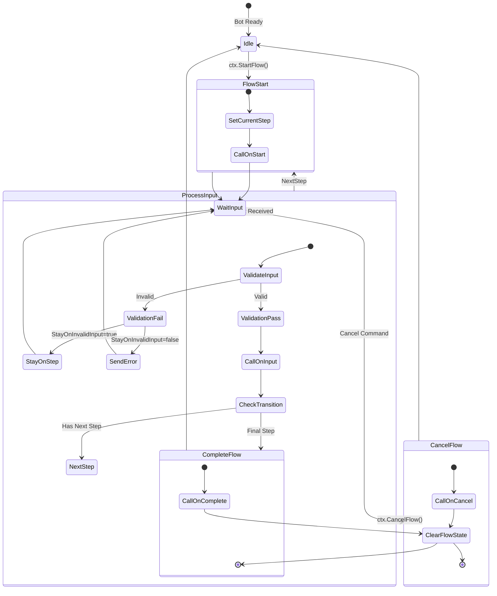
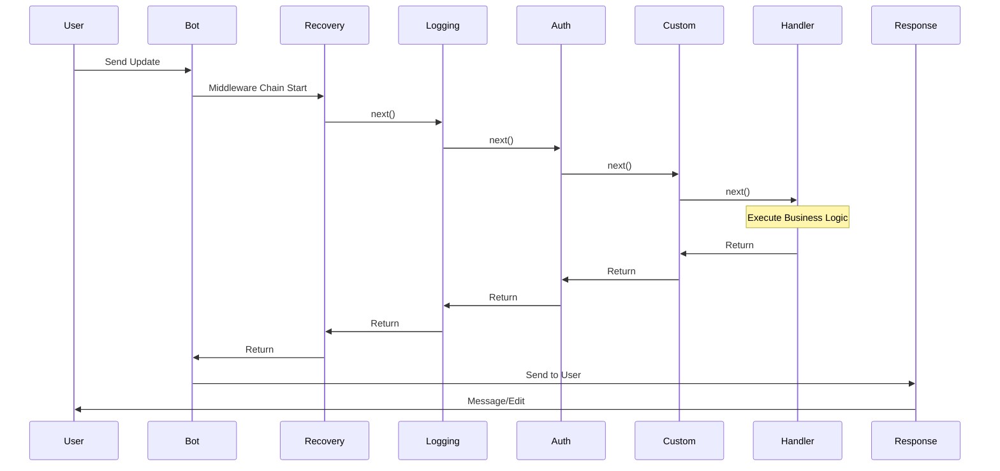
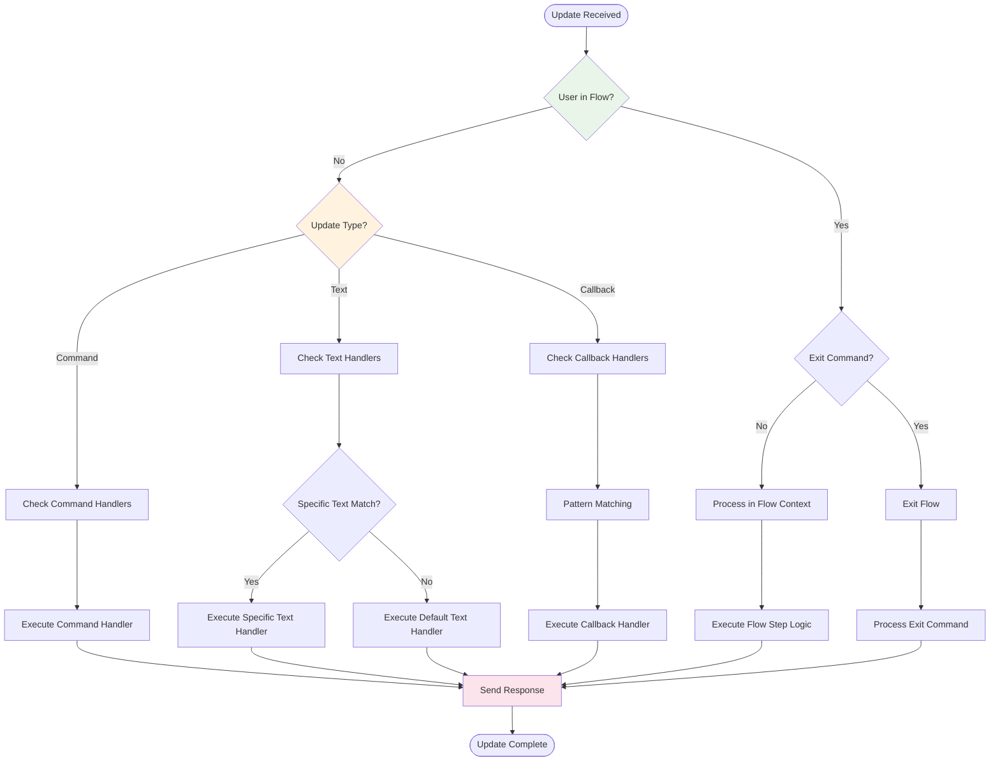

# Teleflow Handlers & Flow System - Visual Architecture Chart

```mermaid
graph TB
    subgraph "🤖 Telegram Bot Updates"
        TU[Telegram Update] --> UD{Update Type}
        UD -->|Command /start| CMD[Command Update]
        UD -->|Text message| TXT[Text Update]
        UD -->|Button press| CB[Callback Update]
    end

    subgraph "🛡️ Middleware Pipeline"
        CMD --> MW1[Recovery Middleware]
        TXT --> MW2[Recovery Middleware]
        CB --> MW3[Recovery Middleware]
        
        MW1 --> MW4[Logging Middleware]
        MW2 --> MW5[Logging Middleware]
        MW3 --> MW6[Logging Middleware]
        
        MW4 --> MW7[Auth Middleware]
        MW5 --> MW8[Auth Middleware]
        MW6 --> MW9[Auth Middleware]
        
        MW7 --> MW10[Custom Middleware]
        MW8 --> MW11[Custom Middleware]
        MW9 --> MW12[Custom Middleware]
    end

    subgraph "🎯 Handler Resolution"
        MW10 --> HR1{Handler Resolution}
        MW11 --> HR2{Handler Resolution}
        MW12 --> HR3{Handler Resolution}
        
        HR1 -->|Check Flow First| FC1{User in Flow?}
        HR2 -->|Check Flow First| FC2{User in Flow?}
        HR3 -->|Check Flow First| FC3{User in Flow?}
        
        FC1 -->|No| CH[Command Handler]
        FC2 -->|No| TH{Text Handler}
        FC3 -->|No| CBH[Callback Handler]
        
        TH -->|Specific Match| STH[Specific Text Handler]
        TH -->|No Match| DTH[Default Text Handler]
    end

    subgraph "🌊 Flow System"
        FC1 -->|Yes| FM[Flow Manager]
        FC2 -->|Yes| FM
        FC3 -->|Yes| FM
        
        FM --> FS{Current Flow Step}
        FS --> FSH[Flow Step Handler]
        
        subgraph "📋 Flow Step Lifecycle"
            FSH --> FSS[OnStart Handler]
            FSS --> FSI[User Input]
            FSI --> FSV{Validator}
            FSV -->|Valid| FSIH[OnInput Handler]
            FSV -->|Invalid| FSE[Stay on Step]
            FSIH --> FST{Transition}
            FST -->|Next Step| FSN[Next Step]
            FST -->|Complete| FSC[OnComplete Handler]
            FST -->|Cancel| FSCX[OnCancel Handler]
            FSE --> FSS
            FSN --> FSS
        end
    end

    subgraph "🎹 UI Components"
        CH --> RK[Reply Keyboard]
        STH --> RK
        DTH --> RK
        CBH --> IK[Inline Keyboard]
        FSS --> IK
        FSIH --> IK
        
        RK --> RM[Reply Message]
        IK --> IM[Inline Message]
    end

    subgraph "📝 Response Generation"
        RM --> TR[Template Rendering]
        IM --> TR
        TR --> TM[Telegram Message]
        TM --> TC[Telegram Chat]
    end

    subgraph "💾 State Management"
        FSS --> SS[Session State]
        FSIH --> SS
        CH --> PS[Persistent State]
        STH --> PS
        CBH --> PS
        
        SS --> RS[Request-Scoped Data]
        PS --> US[User State Storage]
    end

    style TU fill:#e1f5fe
    style MW1 fill:#f3e5f5
    style MW2 fill:#f3e5f5
    style MW3 fill:#f3e5f5
    style FM fill:#e8f5e8
    style FSH fill:#e8f5e8
    style CH fill:#fff3e0
    style STH fill:#fff3e0
    style DTH fill:#fff3e0
    style CBH fill:#fff3e0
    style TR fill:#fce4ec
```



## 🏗️ Handler Type Architecture

```mermaid
graph LR
    subgraph "📡 Input Sources"
        U1[User Types /start] --> CT[Command Text]
        U2[User Clicks Button] --> BD[Button Data]
        U3[User Sends Message] --> MT[Message Text]
        U4[User in Flow] --> FI[Flow Input]
    end

    subgraph "🎯 Handler Types"
        CT --> CH["Command Handler<br/>func(ctx, cmd, args)"]
        MT --> TH["Text Handler<br/>func(ctx, text)"]
        MT --> DH["Default Handler<br/>func(ctx, fullText)"]
        BD --> CBH["Callback Handler<br/>func(ctx, full, extracted)"]
        FI --> FSH["Flow Step Handler<br/>Multiple Types"]
    end

    subgraph "⚙️ Processing"
        CH --> P1[Process Command]
        TH --> P2[Process Text]
        DH --> P3[Process Default]
        CBH --> P4[Process Callback]
        FSH --> P5[Process Flow Step]
    end

    subgraph "📤 Outputs"
        P1 --> O1[Reply/Template]
        P2 --> O2[Reply/Template]
        P3 --> O3[Reply/Template]
        P4 --> O4[Edit/Reply]
        P5 --> O5[Flow Navigation]
    end

    style CH fill:#ffecb3
    style TH fill:#c8e6c9
    style DH fill:#b39ddb
    style CBH fill:#ffcdd2
    style FSH fill:#b2dfdb
```



## 🌊 Flow System Detailed Flow



## 🎛️ Middleware Execution Chain



## 🎹 Keyboard Type Relationships

```mermaid
graph TD
    subgraph "🎹 Keyboard Types"
        RK[Reply Keyboard<br/>Always Visible]
        IK[Inline Keyboard<br/>Attached to Message]
    end

    subgraph "📝 Reply Keyboard Usage"
        RK --> RKU1[Menu Navigation]
        RK --> RKU2[Quick Actions]
        RK --> RKU3[Persistent Options]
        
        RKU1 --> RTH[Text Handler<br/>bot.HandleText]
        RKU2 --> RTH
        RKU3 --> RTH
    end

    subgraph "🖱️ Inline Keyboard Usage"
        IK --> IKU1[Action Buttons]
        IK --> IKU2[Data Selection]
        IK --> IKU3[Flow Navigation]
        
        IKU1 --> CBH[Callback Handler<br/>bot.RegisterCallback]
        IKU2 --> CBH
        IKU3 --> CBH
    end

    subgraph "📊 Handler Routing"
        RTH --> TM[Text Message Processing]
        CBH --> CM[Callback Query Processing]
        
        TM --> TR1[Pattern Matching]
        CM --> TR2[Pattern Matching]
        
        TR1 --> TH1[Specific Text Handler]
        TR1 --> TH2[Default Text Handler]
        
        TR2 --> CB1[Wildcard Patterns]
        TR2 --> CB2[Exact Matches]
    end

    style RK fill:#e8f5e8
    style IK fill:#e3f2fd
    style RTH fill:#fff3e0
    style CBH fill:#fce4ec
```



## 📊 Handler Priority & Execution Order



## 🔄 Data Flow Through System

```mermaid
graph LR
    subgraph "📥 Input Data"
        UI[User Input]
        UI --> UD[Update Data]
        UD --> CD[Command Data]
        UD --> TD[Text Data]
        UD --> BD[Button Data]
    end

    subgraph "🔄 Context Processing"
        CD --> CTX[Context Object]
        TD --> CTX
        BD --> CTX
        
        CTX --> RS[Request-Scoped Data<br/>ctx.Set/Get]
        CTX --> PS[Persistent State<br/>ctx.SetState/GetState]
        CTX --> FD[Flow Data<br/>Flow Context]
    end

    subgraph "⚙️ Handler Processing"
        RS --> HL[Handler Logic]
        PS --> HL
        FD --> HL
        
        HL --> BL[Business Logic]
        BL --> DV[Data Validation]
        DV --> DP[Data Processing]
    end

    subgraph "📤 Output Generation"
        DP --> TG[Template Generation]
        TG --> KG[Keyboard Generation]
        KG --> MF[Message Formatting]
        MF --> TR[Telegram Response]
    end

    subgraph "💾 State Updates"
        DP --> SU[State Updates]
        SU --> PSU[Persistent State Update]
        SU --> FDU[Flow Data Update]
        PSU --> DB[(State Storage)]
        FDU --> FM[Flow Manager]
    end

    style CTX fill:#e1f5fe
    style HL fill:#f3e5f5
    style TG fill:#e8f5e8
    style SU fill:#fff3e0
```



---

## 📋 Handler Type Reference Table

| Handler Type | Trigger | Input Parameters | Use Cases | Registration |
|-------------|---------|------------------|-----------|--------------|
| **Command** | `/command args` | `ctx, command, args` | Bot commands, actions | `HandleCommand()` |
| **Text** | Specific text | `ctx, messageText` | Menu buttons, keywords | `HandleText()` |
| **Default Text** | Any text | `ctx, fullMessageText` | Fallback, AI processing | `SetDefaultTextHandler()` |
| **Callback** | Button press | `ctx, fullData, extracted` | Interactive buttons | `RegisterCallback()` |
| **Flow Start** | Flow step entry | `ctx` | Step initialization | `.OnStart()` |
| **Flow Input** | Flow user input | `ctx, input` | Process step input | `.OnInput()` |
| **Flow Validator** | Before input processing | `input string` | Input validation | `.WithValidator()` |
| **Flow Complete** | Flow completion | `ctx, flowData` | Success handling | `.OnComplete()` |
| **Flow Cancel** | Flow cancellation | `ctx, flowData` | Cleanup, error handling | `.OnCancel()` |

---

## 🎯 Common Patterns Quick Reference

### ✅ Pattern: Menu Navigation
```
User clicks "Settings" → Text Handler → Show settings keyboard
User clicks settings button → Callback Handler → Update/Edit message
```

### ✅ Pattern: Data Collection Flow
```
Start Flow → OnStart (prompt) → User Input → Validator → OnInput → Next Step
```

### ✅ Pattern: Confirmation Dialog
```
Action Button → Callback → Store context → Show confirmation → Confirm/Cancel callbacks
```

### ✅ Pattern: Error Handling
```
Any Handler → Recovery Middleware → Log error → User-friendly message
```

---

*This visual guide illustrates the complete Teleflow handlers and flow system architecture. Use alongside the [cheat sheet](handlers-flow-cheatsheet.md) for comprehensive understanding.*
