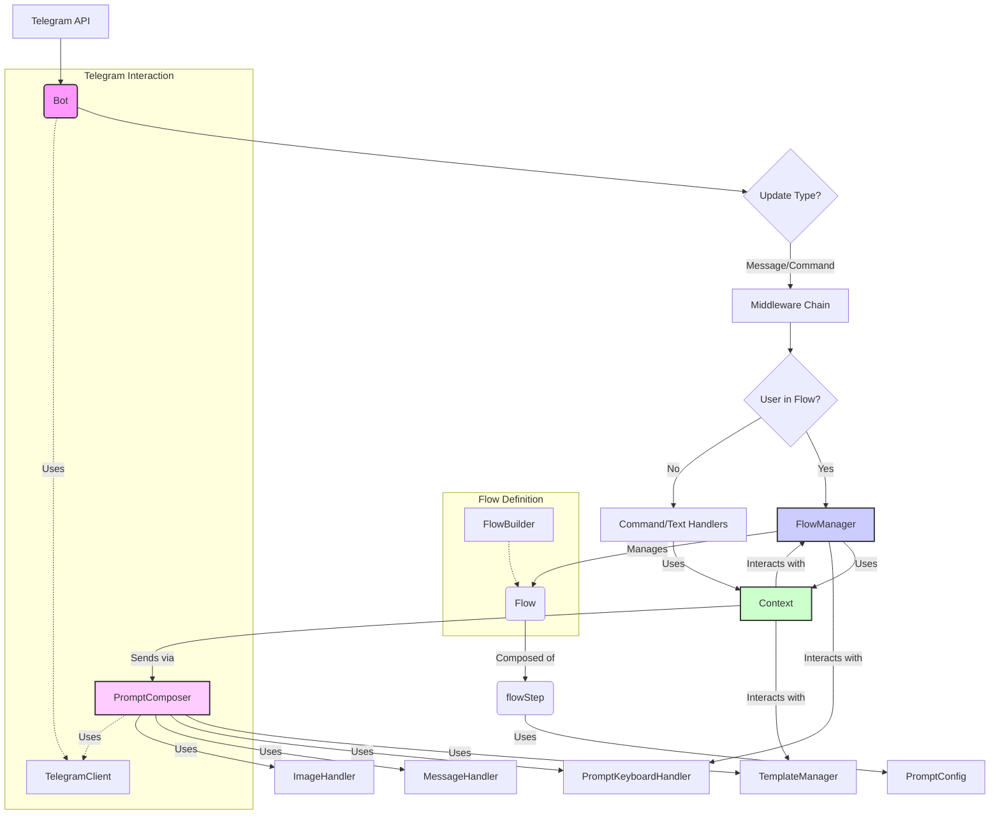

# Teleflow Package Architecture

## 1. Introduction

The `teleflow` package provides a comprehensive framework for building sophisticated Telegram bots in Go. It simplifies the development of complex, multi-step conversational flows by offering robust state management, template-based message rendering, middleware support, and extensive keyboard handling. Key features include:

*   **Multi-step Conversation Flows:** Define and manage intricate user interactions with persistent state across steps.
*   **Template Engine:** Utilize Go templates for dynamic message generation with support for various parse modes (Markdown, HTML).
*   **Middleware:** Implement cross-cutting concerns like logging, authentication, and rate-limiting through a flexible middleware chain.
*   **Keyboard Management:** Easily create and handle both inline and reply keyboards for interactive prompts.
*   **Image and Attachment Handling:** Seamlessly integrate images and other attachments into bot messages.
*   **Configurable Error Handling:** Define strategies for managing errors within flows, ensuring robust bot behavior.
*   **Concurrent Operations:** Designed for concurrent handling of user updates and flow states.

This document outlines the core architecture of the `teleflow` package, detailing its main components, their responsibilities, and key interaction patterns.

## 2. Core Components & Architecture

The `teleflow` package is built around a set of interconnected components that work together to manage bot interactions and conversation flows.



### `Bot` ([`core/bot.go`](core/bot.go:0))

*   **Responsibility:** The central orchestrator of the bot. It initializes the connection with the Telegram API, receives incoming updates, and routes them through middleware to the appropriate handlers (command handlers, text handlers, or the `FlowManager`). It also manages bot-wide configurations like command lists and access control.
*   **Key Types:** `Bot`, `HandlerFunc`, `CommandHandlerFunc`, `TextHandlerFunc`, `AccessManager`.
*   **Key Methods:**
    *   `NewBot(token string, options ...BotOption)`: Creates a new bot instance.
    *   `Start()`: Begins listening for and processing Telegram updates.
    *   `processUpdate(update tgbotapi.Update)`: The core internal method for handling each incoming update.
    *   `HandleCommand(commandName string, handler CommandHandlerFunc)`: Registers a handler for a specific command.
    *   `HandleText(textToMatch string, handler TextHandlerFunc)`: Registers a handler for an exact text match.
    *   `DefaultHandler(handler DefaultHandlerFunc)`: Registers a fallback handler.
    *   `RegisterFlow(flow *Flow)`: Adds a defined flow to the bot.
    *   `UseMiddleware(m MiddlewareFunc)`: Adds a middleware to the processing chain.
    *   `SetBotCommands(commands map[string]string)`: Configures the bot's command menu in Telegram.

### `FlowManager` ([`core/flow.go`](core/flow.go:0))

*   **Responsibility:** Manages the lifecycle of all active conversation flows. It keeps track of which user is in which flow and their current step, stores flow-specific data for each user, and handles the execution of flow steps based on user input.
*   **Key Types:** `flowManager`, `userFlowState`.
*   **Key Methods:**
    *   `newFlowManager(...)`: Initializes the flow manager.
    *   `registerFlow(flow *Flow)`: Makes a flow definition available.
    *   `startFlow(userID int64, flowName string, ctx *Context)`: Initiates a flow for a user.
    *   `HandleUpdate(ctx *Context)`: Processes an update in the context of an active flow. This is the primary entry point for flow logic.
    *   `cancelFlow(userID int64)`: Terminates a flow for a user.
    *   `isUserInFlow(userID int64)`: Checks if a user is currently in any flow.
    *   `setUserFlowData(userID int64, key string, value interface{})`: Stores data for a user within their current flow.
    *   `getUserFlowData(userID int64, key string)`: Retrieves data for a user from their current flow.

### `Flow` & `FlowBuilder` ([`core/flow.go`](core/flow.go:138), [`core/flow_builder.go`](core/flow_builder.go:0), [`core/flow_types.go`](core/flow_types.go:0))

*   **`Flow` Responsibility:** Represents a complete, defined multi-step conversation. It contains an ordered list of steps, an optional completion handler, error handling configuration, and a timeout.
*   **`FlowBuilder` Responsibility:** Provides a fluent API to define and construct `Flow` objects programmatically.
*   **Key Types:** `Flow`, `FlowBuilder`, `ErrorConfig`.
*   **`FlowBuilder` Key Methods:**
    *   `NewFlow(name string)`: Starts building a new flow.
    *   `Step(name string)`: Adds a new step to the flow.
    *   `OnComplete(handler func(*Context) error)`: Sets a callback for successful flow completion.
    *   `OnError(config *ErrorConfig)`: Configures flow-wide error handling.
    *   `WithTimeout(duration time.Duration)`: Sets a timeout for the flow.
    *   `Build()`: Finalizes the flow definition and returns a `Flow` object.

### `flowStep` ([`core/flow.go`](core/flow.go:148))

*   **Responsibility:** Represents a single stage or interaction point within a `Flow`. Each step defines what prompt to show the user and how to process their response.
*   **Key Types:** `flowStep`.
*   **Key Fields:**
    *   `Name`: Unique identifier for the step.
    *   `PromptConfig`: Defines the message, image, and keyboard to present to the user.
    *   `ProcessFunc`: A function that takes user input (text or button click) and decides the next action (e.g., move to next step, retry, complete flow).

### `Context` ([`core/context.go`](core/context.go:0))

*   **Responsibility:** An object passed to all handlers and flow processing functions. It encapsulates the incoming Telegram update, provides convenient methods for sending messages, managing flow-specific data, interacting with templates, and controlling flow execution. Each `Context` is specific to a single update.
*   **Key Types:** `Context`.
*   **Key Methods:**
    *   `UserID()`, `ChatID()`: Get user and chat identifiers.
    *   `Set(key string, value interface{})`, `Get(key string)`: Manage request-scoped data.
    *   `SetFlowData(key string, value interface{})`, `GetFlowData(key string)`: Manage data persistent within the current user's flow.
    *   `StartFlow(flowName string)`: Initiates a new flow for the user.
    *   `CancelFlow()`: Cancels the user's current flow.
    *   `SendPrompt(prompt *PromptConfig)`: Sends a complex message (text, image, keyboard).
    *   `SendPromptText(text string)`: Sends a simple text message.
    *   `SendPromptWithTemplate(templateName string, data map[string]interface{})`: Sends a message using a registered template.
    *   `AddTemplate(...)`, `RenderTemplate(...)`: Manage and use message templates.
    *   `answerCallbackQuery(text string)`: Responds to a Telegram callback query.

### `PromptConfig` ([`core/flow_types.go`](core/flow_types.go:31))

*   **Responsibility:** A struct that defines all aspects of a message to be sent to the user. This is used by `flowStep` to define its prompt and can also be used directly with `Context.SendPrompt`.
*   **Key Types:** `PromptConfig`, `MessageSpec`, `ImageSpec`, `KeyboardFunc`.
*   **Key Fields:**
    *   `Message`: The text content (can be a string, a function returning a string, or a "template:name" reference).
    *   `Image`: Optional image to include (URL, file path, bytes, or a function returning one of these).
    *   `Keyboard`: A function that returns a `PromptKeyboardBuilder` to define an inline keyboard.
    *   `TemplateData`: Data to be used if `Message` is a template reference.

### `PromptComposer` ([`core/prompt_composer.go`](core/prompt_composer.go:0))

*   **Responsibility:** Implements the `PromptSender` interface. It takes a `PromptConfig` and orchestrates the construction and sending of the actual message to Telegram. It interacts with the `TemplateManager` to render templates, the `MessageHandler` to format text, the `ImageHandler` to prepare images, and the `PromptKeyboardHandler` to build and register inline keyboards.
*   **Key Types:** `PromptComposer`.
*   **Key Methods:**
    *   `ComposeAndSend(ctx *Context, config *PromptConfig)`: The primary method that processes a `PromptConfig` and sends the message.

### `PromptKeyboardHandler` ([`core/prompt_keyboard_handler.go`](core/prompt_keyboard_handler.go:0))

*   **Responsibility:** Manages the data associated with inline keyboard buttons. When an inline keyboard is created, each button can have associated data. Since Telegram callback queries only return a short string (callback_data), this handler stores a mapping between a user ID, a generated unique ID (UUID) for the button's callback_data, and the original, richer data.
*   **Key Types:** `PromptKeyboardHandler`, `PromptKeyboardActions` (interface).
*   **Key Methods:**
    *   `BuildKeyboard(ctx *Context, keyboardFunc KeyboardFunc)`: Called by `PromptComposer`. It executes the `keyboardFunc` (defined in `PromptConfig`), which uses `PromptKeyboardBuilder` to define buttons. `BuildKeyboard` then stores UUID-to-data mappings for the user.
    *   `GetCallbackData(userID int64, uuid string)`: Called by `FlowManager` when a callback query is received. It uses the UUID from the callback to retrieve the original data associated with the button.
    *   `CleanupUserMappings(userID int64)`: Called by `FlowManager` when a user's flow ends to remove their UUID mappings and prevent memory leaks.
*   **Interaction:**
    *   `PromptComposer` calls `BuildKeyboard` when sending a message with a keyboard.
    *   `FlowManager` calls `GetCallbackData` to resolve button presses during `HandleUpdate`.
    *   `FlowManager` calls `CleanupUserMappings` on flow completion or cancellation.

### `TemplateManager` ([`core/template_manager.go`](core/template_manager.go:0))

*   **Responsibility:** Manages message templates. It allows registering Go templates with specific parse modes (e.g., MarkdownV2, HTML) and rendering them with provided data.
*   **Key Types:** `TemplateManager` (interface), `templateManager` (implementation), `TemplateInfo`.
*   **Key Methods:**
    *   `AddTemplate(name, templateText string, parseMode ParseMode)`: Registers a new template.
    *   `RenderTemplate(name string, data map[string]interface{})`: Renders a named template with data.
    *   `GetTemplateInfo(name string)`: Retrieves information about a template.

### Middleware ([`core/middleware.go`](core/middleware.go:0), [`core/middleware_types.go`](core/middleware_types.go:0))

*   **Responsibility:** Functions that wrap around the main handlers (`CommandHandlerFunc`, `TextHandlerFunc`, `DefaultHandlerFunc`, and flow processing). They allow for implementing cross-cutting concerns like logging, authentication, rate limiting, or modifying the `Context` before it reaches the handler.
*   **Key Types:** `MiddlewareFunc`, `HandlerFunc`.
*   **Execution:** Middleware functions are applied in a LIFO (Last-In, First-Out) order, meaning the last middleware added is the first one to execute.

## 3. Key Interaction Flows

### Bot Initialization and Update Handling

1.  **Initialization:**
    *   `teleflow.NewBot(token, ...)` is called.
    *   A `TelegramClient` (e.g., `tgbotapi.BotAPI`) is created.
    *   Core components like `FlowManager`, `PromptComposer`, `TemplateManager`, `PromptKeyboardHandler` are initialized.
    *   Middleware and handlers are registered using `bot.UseMiddleware()`, `bot.HandleCommand()`, etc.
2.  **Starting the Bot:**
    *   `bot.Start()` is called.
    *   The bot begins polling Telegram for updates via `TelegramClient.GetUpdatesChan()`.
3.  **Processing an Update (`Bot.processUpdate`)**:
    This is a critical method that orchestrates how each incoming update is handled.

    ```mermaid
    graph TD
        Start((Update Received)) --> CreateCtx[Create Context];
        CreateCtx --> UserInFlow{User in Flow?};

        UserInFlow -- Yes --> GlobalExitCmd{Global Exit Cmd?};
        GlobalExitCmd -- Yes --> CancelFlow[Cancel Flow & Notify];
        GlobalExitCmd -- No --> AllowGlobalCmd{Allow Global Cmds?};

        AllowGlobalCmd -- Yes --> IsGlobalCmd{Is Global Cmd?};
        IsGlobalCmd -- Yes --> HandleGlobalCmd[Handle Global Cmd];
        IsGlobalCmd -- No --> TryFlowManager;
        AllowGlobalCmd -- No --> TryFlowManager;

        UserInFlow -- No --> TryFlowManager;

        TryFlowManager --> FMHandle["FlowManager.HandleUpdate(ctx)"];
        FMHandle --> HandledByFlow{Handled by Flow?};

        HandledByFlow -- Yes --> EndFlow((End Update Processing for Flow));
        HandledByFlow -- No --> IsMsg{Update.Message?};

        IsMsg -- Yes --> IsCmd{Message.IsCommand?};
        IsCmd -- Yes --> FindCmdHandler{Find Command Handler};
        FindCmdHandler --> CmdHandlerExists{Handler Exists?};
        CmdHandlerExists -- Yes --> ExecCmdHandler[Execute Command Handler];
        CmdHandlerExists -- No --> TryDefaultHandler1;

        IsCmd -- No --> FindTextHandler{Find Text Handler};
        FindTextHandler --> TextHandlerExists{Handler Exists?};
        TextHandlerExists -- Yes --> ExecTextHandler[Execute Text Handler];
        TextHandlerExists -- No --> TryDefaultHandler1;

        TryDefaultHandler1 --> DefaultHandlerExists1{Default Handler Exists?};
        DefaultHandlerExists1 -- Yes --> ExecDefaultHandler1[Execute Default Handler];
        DefaultHandlerExists1 -- No --> EndNoHandler1((End - No Handler));

        IsMsg -- No --> IsCallback{Update.CallbackQuery?};
        IsCallback -- Yes --> AnswerCallback[Answer CallbackQuery];
        AnswerCallback --> EndCallback((End - Callback Answered));
        IsCallback -- No --> EndUnknown((End - Unknown Update Type));

        ExecCmdHandler --> HandleError;
        ExecTextHandler --> HandleError;
        ExecDefaultHandler1 --> HandleError;
        HandleGlobalCmd --> HandleError;
        FMHandle -- Error --> HandleError;

        HandleError --> LogError[Log Error];
        LogError --> MaybeReplyError{Reply with Generic Error?};
        MaybeReplyError --> EndError((End Update Processing));

        CancelFlow --> EndFlowExit((End Update Processing));
        EndFlow --> End;
        EndNoHandler1 --> End;
        EndCallback --> End;
        EndUnknown --> End;
        EndError --> End((End));
    ```
    *   **Context Creation:** A new `Context` object is created for the update.
    *   **Flow Pre-checks:**
        *   If the user is in a flow, it checks for global exit commands (e.g., `/cancel`). If matched, the flow is cancelled.
        *   If global commands are allowed during flows, it checks if the message is a registered global command (e.g., `/help`) and handles it.
    *   **Delegation to `FlowManager`:** `FlowManager.HandleUpdate(ctx)` is called. If the `FlowManager` successfully handles the update (meaning the user is in a flow and the input is processed by the current step), processing for this update typically ends.
    *   **Fallback to Command/Text Handlers:** If not handled by a flow:
        *   If it's a command, the registered `CommandHandlerFunc` is executed.
        *   If it's a text message, the registered `TextHandlerFunc` (for exact matches) is executed.
        *   If no specific command or text handler matches, the `DefaultHandlerFunc` is executed.
    *   **Callback Query Handling:** If the update is a `CallbackQuery` (from an inline button press):
        *   The bot first answers the callback query using `ctx.answerCallbackQuery()` (required by Telegram).
        *   The actual processing of the callback data (e.g., advancing a flow) is typically handled within `FlowManager.HandleUpdate` if the user was in a flow when they clicked the button.
    *   **Error Logging:** Any errors returned by handlers are logged. A generic error message might be sent to the user.

### Command/Text Handling (No Flow)

1.  Update arrives at `Bot.processUpdate`.
2.  `Context` is created.
3.  `FlowManager.HandleUpdate` is called; if the user is not in a flow, it returns indicating not handled.
4.  The `Bot` checks if the message is a command:
    *   If yes, it looks up the command in its `handlers` map.
    *   The `HandlerFunc` (which wraps the `CommandHandlerFunc`) is retrieved.
    *   The middleware chain is applied, and the final `CommandHandlerFunc` is executed.
5.  If not a command, the `Bot` checks if the message text matches any key in its `textHandlers` map:
    *   If yes, the corresponding `HandlerFunc` (wrapping `TextHandlerFunc`) is executed after middleware.
6.  If neither, the `defaultTextHandler` (if set) is executed after middleware.

### Flow Lifecycle

1.  **Flow Definition (`FlowBuilder`):**
    *   Developer uses `teleflow.NewFlow("flow_name")` to get a `FlowBuilder`.
    *   Chains methods like `.Step("step1").Prompt(...).Process(...)`, `.Step("step2")...`, `.OnComplete(...)`, `.OnError(...)`.
    *   Calls `.Build()` to get a `*Flow` object.
2.  **Flow Registration:**
    *   Developer calls `bot.RegisterFlow(myFlow)`.
    *   The `FlowManager` stores this flow definition in its `flows` map.
3.  **Starting a Flow:**
    *   Typically, a command handler or another flow step calls `ctx.StartFlow("flow_name")`.
    *   `Context.StartFlow` calls `FlowManager.startFlow(userID, "flow_name", ctx)`.
    *   `FlowManager`:
        *   Checks if the flow exists.
        *   Creates a `userFlowState` for the user, setting the `CurrentStep` to the first step in the flow's `Order`.
        *   Stores initial data from the `Context` into `userFlowState.Data`.
        *   Calls `renderStepPrompt` to send the prompt for the first step. This involves `PromptComposer.ComposeAndSend`.
4.  **Processing a Flow Step:**
    *   User sends a message or clicks an inline button.
    *   Update arrives at `Bot.processUpdate`.
    *   `FlowManager.HandleUpdate(ctx)` is called.
    *   `FlowManager`:
        *   Retrieves the `userFlowState` and the current `Flow` and `flowStep`.
        *   Extracts input text or `ButtonClick` data. If it's a `ButtonClick` from an inline keyboard:
            *   It gets the `uuid` from `update.CallbackQuery.Data`.
            *   It calls `PromptKeyboardHandler.GetCallbackData(userID, uuid)` to retrieve the original data associated with the button. This data is then put into the `ButtonClick` struct.
        *   Calls the `currentStep.ProcessFunc(ctx, input, buttonClick)`.
        *   The `ProcessFunc` executes custom logic, potentially using `ctx.SetFlowData()` or `ctx.GetFlowData()`.
        *   `ProcessFunc` returns a `ProcessResult` (e.g., `teleflow.NextStep()`, `teleflow.GoToStep("other_step")`, `teleflow.Retry()`, `teleflow.CompleteFlow()`).
        *   `FlowManager` handles the `ProcessResult`:
            *   `actionNextStep`: Advances `userFlowState.CurrentStep` and renders the next step's prompt.
            *   `actionGoToStep`: Sets `userFlowState.CurrentStep` to `TargetStep` and renders its prompt.
            *   `actionRetryStep`: Re-renders the current step's prompt.
            *   `actionCompleteFlow`: Calls `completeFlow_nolock`.
            *   `actionCancelFlow`: Calls `cancelFlowAction_nolock`.
        *   If the `ProcessResult` includes a `.WithPrompt(...)`, that informational prompt is sent before the main action.
5.  **Flow Completion/Cancellation:**
    *   **Completion:**
        *   Triggered by `teleflow.CompleteFlow()` from a `ProcessFunc` or by reaching the end of steps.
        *   `FlowManager.completeFlow_nolock` is called.
        *   If `flow.OnComplete` handler is set, it's executed (can use `ctx` to send final messages).
        *   `PromptKeyboardHandler.CleanupUserMappings(userID)` is called.
        *   The `userFlowState` is deleted.
    *   **Cancellation:**
        *   Triggered by `teleflow.CancelFlow()` from a `ProcessFunc`, a global exit command, or flow timeout (not explicitly detailed but implied by `Flow.Timeout`).
        *   `FlowManager.cancelFlowAction_nolock` (or `cancelFlow` directly for global exit).
        *   `PromptKeyboardHandler.CleanupUserMappings(userID)` is called.
        *   The `userFlowSate` is deleted.

### Message Sending (via `Context.SendPrompt`)

1.  Handler or flow step calls `ctx.SendPrompt(promptConfig)`.
2.  `Context.SendPrompt` calls `PromptSender.ComposeAndSend(ctx, promptConfig)` (where `PromptSender` is typically `PromptComposer`).
3.  `PromptComposer.ComposeAndSend`:
    *   **Message Content:**
        *   If `promptConfig.Message` is a function, it's called to get the string.
        *   If `promptConfig.Message` is "template:name", `TemplateManager.RenderTemplate(name, promptConfig.TemplateData)` is called.
        *   The resulting text is processed by `MessageHandler` for formatting (e.g., Markdown parsing).
    *   **Image:**
        *   If `promptConfig.Image` is present, `ImageHandler` processes it (e.g., reads file, prepares for upload).
    *   **Keyboard:**
        *   If `promptConfig.Keyboard` (a `KeyboardFunc`) is present:
            *   `PromptKeyboardHandler.BuildKeyboard(ctx, promptConfig.Keyboard)` is called.
            *   This executes the `KeyboardFunc`, which uses `PromptKeyboardBuilder` to define buttons.
            *   `PromptKeyboardHandler` registers UUIDs for callback data and returns the `tgbotapi.InlineKeyboardMarkup`.
    *   **Sending:** The `PromptComposer` constructs the appropriate `tgbotapi.Chattable` (e.g., `MessageConfig`, `PhotoConfig`) and sends it via `TelegramClient.Send()`.

## 4. Important Interfaces

*   **`TelegramClient` ([`core/telegram_client.go`](core/telegram_client.go:0)):** An abstraction over the Telegram Bot API communication library (e.g., `tgbotapi.BotAPI`). Allows for easier testing and potential swapping of the underlying library. Used by `Bot` and `PromptComposer`.
*   **`PromptSender` ([`core/interfaces.go`](core/interfaces.go:4)):** Defines the contract for sending prompts. Implemented by `PromptComposer`. Used by `Context` and `FlowManager`.
*   **`MessageCleaner` ([`core/interfaces.go`](core/interfaces.go:12)):** Defines methods for deleting messages or editing their reply markup. Implemented by `Bot` (which delegates to `TelegramClient`). Used by `FlowManager`.
*   **`ContextFlowOperations` ([`core/interfaces.go`](core/interfaces.go:22)):** Defines methods for interacting with user flows from the `Context`. Implemented by `FlowManager`. Used by `Context`.
*   **`AccessManager` ([`core/bot.go`](core/bot.go:50)):** Defines the contract for controlling user access to bot features. Used by `AuthMiddleware` and `Context`.
*   **`TemplateManager` ([`core/templates.go`](core/templates.go:0)):** Defines the contract for managing and rendering templates. Used by `Context` and `PromptComposer`.
*   **`PromptKeyboardActions` ([`core/prompt_keyboard_handler.go`](core/prompt_keyboard_handler.go:10)):** Defines actions for building keyboards and managing callback data. Implemented by `PromptKeyboardHandler`. Used by `FlowManager` and `PromptComposer`.

## 5. Error Handling

*   Flows can have a global `OnError` configuration (`FlowBuilder.OnError()`) using `ErrorConfig`.
*   `ErrorConfig` specifies an `Action` (`errorStrategyCancel`, `errorStrategyRetry`, `errorStrategyIgnore`) and an optional `Message` to send to the user.
*   If an error occurs during `PromptComposer.ComposeAndSend` (e.g., rendering a step's prompt) or if a `ProcessFunc` returns an error (though `ProcessFunc` itself returns `ProcessResult`, errors are typically handled by retrying or changing state), the `FlowManager` consults the `Flow.OnError` config.
    *   `errorStrategyCancel`: The flow is terminated for the user.
    *   `errorStrategyRetry`: The current step's prompt is re-sent (or an error message is shown).
    *   `errorStrategyIgnore`: An optional message is sent, and the flow attempts to continue (e.g., by trying to render the prompt again or advancing if rendering failed).
*   Errors in regular command/text handlers are returned to the `Bot.processUpdate` method, logged, and a generic error message might be sent to the user.

## 6. Extensibility

*   **Middleware:** Add custom `MiddlewareFunc` to intercept and process updates before they reach handlers or flow logic.
*   **Custom `AccessManager`:** Implement the `AccessManager` interface to define fine-grained permission control for commands and bot features.
*   **Custom Template Functions:** The `TemplateManager` can be extended with custom Go template functions for more complex message rendering.
*   **Custom Handlers:** Define various `CommandHandlerFunc`, `TextHandlerFunc`, and `DefaultHandlerFunc` for bot interactions outside of flows.
*   **Flow Logic:** The `ProcessFunc` within each flow step allows for arbitrary Go code to handle user input and make decisions.