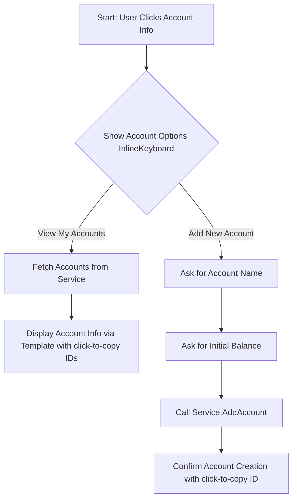
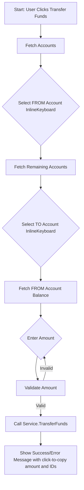
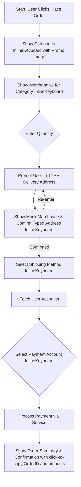

# Plan: New Business Flow Example (`example/business_flow/main.go`)

This example will simulate a business bot with features like account management, fund transfers, and placing orders. It will showcase:
*   Main menu via `ReplyKeyboard`.
*   Bot commands (`/start`, `/help`, `/cancel`) set via `SetBotCommands`.
*   Multi-step flows using `FlowBuilder`.
*   `InlineKeyboard` for choices.
*   Complex callback data handling.
*   Usage of various prompts with dynamic data via `TemplateManager`, with click-to-copy fields.
*   Dynamically generated images (mocked) based on context.
*   Integration with a mock "business service" for data persistence (in-memory).

## 1. Project Structure

*   `example/business_flow/main.go`: Main application setup and bot initialization.
*   `example/business_flow/business_service.go`: Mock service for account and order data.
*   `example/business_flow/flows.go`: Definitions for all the flows (Account, Transfer, Order).
*   `example/business_flow/keyboards.go`: Helper functions for building keyboards.
*   `example/business_flow/templates.go`: Definitions of message templates.
*   `example/business_flow/image_generator.go`: Simple mock image generation.

## 2. Core Components to Implement

### a. Mock Business Service (`business_service.go`)
This service will manage user accounts and basic order information in memory.
*   `UserAccount` struct (e.g., `AccountID` (string, perhaps a UUID), `AccountName`, `Balance`).
*   `UserData` struct (e.g., `TelegramUserID`, `Accounts[]UserAccount`).
*   Functions:
    *   `GetAccounts(userID int64) []UserAccount`
    *   `AddAccount(userID int64, accountName string, initialBalance float64) error`
    *   `GetAccountBalance(userID int64, accountID string) (float64, error)`
    *   `TransferFunds(userID int64, fromAccountID string, toAccountID string, amount float64) error`
    *   `ProcessPayment(userID int64, accountID string, amount float64) error`

### b. Mock Image Generator (`image_generator.go`)
Similar to `example/basic-flow/genimage.go`.
*   `GenerateImage(text string, width int, height int) []byte`
    *   Used for: "Latest Tech Gadgets" promo, "Map for [Location]" confirmation.

### c. Templates (`templates.go`) - Updated for Click-to-Copy
*   `account_info`: "Username: `{{.Username}}`\nID: `{{.UserID}}`\nName: {{.FirstName}} {{.LastName}}\n\nAccounts:\n{{range .Accounts}}- {{.Name}} (ID: `{{.AccountID}}`): ${{printf "%.2f" .Balance}}\n{{end}}"
*   `transfer_success`: "Transfer of `${{printf "%.2f" .Amount}}` from account `{{.FromAccountID}}` to account `{{.ToAccountID}}` successful."
*   `order_summary`: "Order Summary (Order ID: `{{.OrderID}}`):\nItem: {{.ItemName}}\nQty: {{.Quantity}}\nPrice: `${{printf "%.2f" .ItemPrice}}`\nShipping: {{.ShippingMethod}} (`${{printf "%.2f" .ShippingCost}}`)\nTotal: `${{printf "%.2f" .TotalAmount}}`"
*   `start_message_template`: (For `/start` command) "Welcome to the Teleflow Demo Bot! This bot showcases various features like multi-step flows, dynamic keyboards, and template-based messages. Explore account management, fund transfers, and place a mock order!" (To be accompanied by an image).
*   `help_message_template`: (For `/help` command) "Available Commands & Menu Options:\n\nReply Keyboard:\n- *Account Info*: View your accounts or add a new one.\n- *Transfer Funds*: Move funds between your accounts.\n- *Place Order*: Browse items and simulate an order.\n\nCommands:\n- `/start`: Shows this welcome message.\n- `/help`: Displays this help information.\n- `/cancel`: Exits any current operation or flow."

### d. Keyboards (`keyboards.go`)
Helper functions to generate `ReplyKeyboard` and `InlineKeyboard`.
*   `MainMenuKeyboard()`
*   `AccountActionsKeyboard()` (e.g., "View Accounts", "Add Account")
*   `CategorySelectionKeyboard(categories []string)`
*   `MerchandiseSelectionKeyboard(items []Merchandise)`
*   `ShippingSelectionKeyboard(methods []ShippingOption)`
*   `PaymentAccountSelectionKeyboard(accounts []UserAccount)`

## 3. Main Application Logic (`main.go`) - Updated for Bot Commands
*   Initialize `Bot` with token and `FlowConfig` (setting `GlobalExitCommand` to "cancel").
*   Initialize services and `TemplateManager`.
*   Register templates.
*   Set Bot Commands:
    *   Use `b.SetBotCommands(map[string]string{"start": "Welcome & Intro", "help": "Show Help", "cancel": "Cancel Current Action"})`.
*   Register Command Handlers:
    *   `/start`: Sends `start_message_template` with a mock intro image.
    *   `/help`: Sends `help_message_template`.
    *   `/cancel`: (Handled by flow manager if `GlobalExitCommand` is set).
*   Register flows.
*   Set up the main menu `ReplyKeyboard`.
*   Start the bot.

## 4. Flow Definitions (`flows.go`)

### a. Main Menu and Navigation
*   The `ReplyKeyboard` will have buttons: "Account Info", "Transfer Funds", "Place Order".

### b. Account Info Flow

### c. Transfer Funds Flow

### d. Place Order Flow - Updated Location Input
*   **Step 1: Show Categories**
*   **Step 2: Show Merchandise**
*   **Step 3: Enter Quantity**
*   **Step 4: Request Location - Revised**
    *   Prompt: "Please *type* your full delivery address:"
*   **Step 5: Confirm Location (Map) - Revised**
    *   Image: Dynamically generated mock map image with "Map for '{{.DeliveryAddress}}' - Confirm delivery here?".
    *   Prompt: "Confirm delivery address: `{{.DeliveryAddress}}`?"
    *   Keyboard: `InlineKeyboard` ("Yes, Confirm", "No, Re-enter Address").
*   **Step 6: Select Shipping Method**
*   **Step 7: Select Payment Method**
*   **Step 8: Order Confirmation & Payment**

## 5. Error Handling and Flow Control
*   Global exit command `/cancel` will be configured.