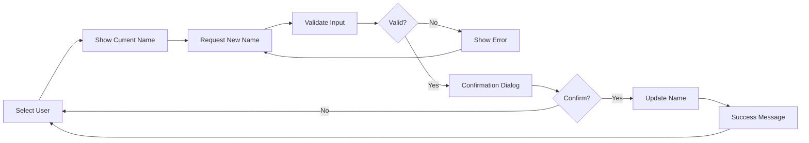
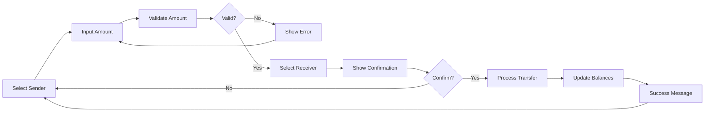

# Advanced User Management Bot - Implementation Plan

## 🎯 Project Overview

This implementation plan details the creation of an advanced user management bot that showcases the full capabilities of the teleflow framework. The bot demonstrates complex multi-step flows, dynamic UI management, pattern-based callbacks, and template-driven content while maintaining clean, educational code.

## 📋 Technical Requirements

### Core Features to Implement
- **Main Reply Keyboard**: User Manager button and Help button
- **Menu Button Commands**: /start, /help, /cancel commands
- **User Management System** with dynamic inline keyboards
- **Complex Flow System**: Change Name, Toggle Status, Transfer Balance
- **Template Engine**: All messages rendered via templates
- **Clean Architecture**: Separated concerns for educational purposes

### Teleflow Features Demonstrated
- ✅ Advanced Flow Management with validation and branching
- ✅ Callback System with pattern matching and data extraction
- ✅ Template System with multiple parse modes
- ✅ Dynamic Keyboard Management (inline and reply)
- ✅ Middleware Usage and State Management
- ✅ Automatic UI Management System
- ✅ Menu Button Integration

## 🗂️ File Structure

```
examples/advanced-user-manager/
├── main.go                          # Entry point and bot configuration
├── README.md                        # Usage documentation and feature guide
├── .env.example                     # Environment variable template
├── handlers/
│   ├── commands.go                  # Command handlers (/start, /help, /cancel)
│   ├── callbacks.go                 # Callback pattern matching and handlers
│   ├── flows.go                     # Flow definitions and step handlers
│   └── keyboards.go                 # Dynamic keyboard generation utilities
├── models/
│   ├── user.go                      # User data structure and validation
│   └── mock_data.go                 # Sample user dataset (8-10 users)
├── services/
│   ├── user_service.go              # User CRUD operations and business logic
│   └── access_manager.go            # Role-based UI management and permissions
└── templates/
    ├── templates.go                 # All message templates with different parse modes
    └── functions.go                 # Custom template functions and helpers
```

## 📊 Data Model Implementation

### User Structure
```go
// models/user.go
type User struct {
    ID      int64   `json:"id"`      // Unique identifier
    Name    string  `json:"name"`    // Display name (editable)
    Enabled bool    `json:"enabled"` // Account status (toggleable)
    Balance float64 `json:"balance"` // Balance for transfers (transferable)
}

// UserService interface for operations
type UserService interface {
    GetAllUsers() []User
    GetUserByID(id int64) (*User, error)
    UpdateUser(user *User) error
    TransferBalance(fromID, toID int64, amount float64) error
    GetActiveUsers() []User
    GetUserCount() int
}
```

### Mock Data Specifications
```go
// models/mock_data.go - Sample data for demonstrations
var MockUsers = []User{
    {ID: 1, Name: "Alice Smith", Enabled: true, Balance: 150.50},
    {ID: 2, Name: "Bob Johnson", Enabled: true, Balance: 75.25},
    {ID: 3, Name: "Carol Williams", Enabled: false, Balance: 200.00},
    {ID: 4, Name: "Dave Brown", Enabled: true, Balance: 0.00},
    {ID: 5, Name: "Eve Davis", Enabled: true, Balance: 325.75},
    {ID: 6, Name: "Frank Wilson", Enabled: false, Balance: 50.00},
    {ID: 7, Name: "Grace Miller", Enabled: true, Balance: 500.00},
    {ID: 8, Name: "Henry Taylor", Enabled: true, Balance: 12.50},
}
```

## 🎛️ User Interface Design

### Main Reply Keyboard Layout
```
┌─────────────────┬─────────────────┐
│  👥 User Manager │     ❓ Help     │
└─────────────────┴─────────────────┘
```

### User List Inline Keyboard (Dynamic)
```
┌─────────────────┬─────────────────┬─────────────────┐
│  👤 Alice ($150) │   👤 Bob ($75)   │ 👤 Carol ($200) │
│       ✅         │       ✅         │       ❌        │
├─────────────────┼─────────────────┼─────────────────┤
│  👤 Dave ($0)    │   👤 Eve ($326)  │ 👤 Frank ($50)  │
│       ✅         │       ✅         │       ❌        │
├─────────────────┼─────────────────┼─────────────────┤
│ 👤 Grace ($500)  │ 👤 Henry ($13)   │                │
│       ✅         │       ✅         │                │
├─────────────────┴─────────────────┴─────────────────┤
│                  ❌ Close Menu                      │
└─────────────────────────────────────────────────────┘
```

### User Action Keyboard
```
┌─────────────────┬─────────────────┬─────────────────┐
│  ✏️ Change Name  │ 🔄 Enable/Disable│  💰 Transfer    │
├─────────────────┴─────────────────┴─────────────────┤
│                  ⬅️ Back to List                    │
└─────────────────────────────────────────────────────┘
```

## 🌊 Flow System Implementation

### Flow 1: Change Name Flow


**Implementation Details:**
```go
// flows.go - Change Name Flow
func CreateChangeNameFlow() *teleflow.Flow {
    return teleflow.NewFlow("change_name").
        Step("show_current").
        OnInput(func(ctx *teleflow.Context) error {
            userID, _ := ctx.Get("target_user_id")
            user, _ := userService.GetUserByID(userID.(int64))
            
            return ctx.ReplyTemplate("current_name", map[string]interface{}{
                "User": user,
            })
        }).
        Step("request_new_name").
        OnInput(func(ctx *teleflow.Context) error {
            newName := ctx.Update.Message.Text
            ctx.Set("new_name", newName)
            
            userID, _ := ctx.Get("target_user_id")
            return ctx.ReplyTemplate("confirm_name_change", map[string]interface{}{
                "UserID": userID,
                "NewName": newName,
            })
        }).
        WithValidator(nameValidator()).
        Step("confirm").
        OnInput(handleNameConfirmation).
        OnComplete(func(ctx *teleflow.Context) error {
            return ctx.ReplyTemplate("name_change_success", nil)
        }).
        Build()
}

func nameValidator() teleflow.FlowValidatorFunc {
    return func(input string) (bool, string) {
        if len(strings.TrimSpace(input)) < 2 {
            return false, "❌ Name must be at least 2 characters long"
        }
        if len(input) > 50 {
            return false, "❌ Name must be less than 50 characters"
        }
        return true, ""
    }
}
```

### Flow 2: Transfer Balance Flow


**Implementation Details:**
```go
// flows.go - Transfer Balance Flow
func CreateTransferFlow() *teleflow.Flow {
    return teleflow.NewFlow("transfer_balance").
        Step("input_amount").
        OnInput(func(ctx *teleflow.Context) error {
            amountStr := ctx.Update.Message.Text
            amount, err := strconv.ParseFloat(amountStr, 64)
            if err != nil {
                return ctx.Reply("❌ Please enter a valid number")
            }
            
            ctx.Set("transfer_amount", amount)
            senderID, _ := ctx.Get("sender_id")
            
            // Generate receiver selection keyboard
            keyboard := createReceiverKeyboard(senderID.(int64))
            return ctx.ReplyTemplate("select_receiver", map[string]interface{}{
                "Amount": amount,
            }, keyboard)
        }).
        WithValidator(amountValidator()).
        Step("select_receiver").
        OnInput(handleReceiverSelection).
        Step("confirm_transfer").
        OnInput(handleTransferConfirmation).
        OnComplete(func(ctx *teleflow.Context) error {
            return ctx.ReplyTemplate("transfer_success", nil)
        }).
        Build()
}

func amountValidator() teleflow.FlowValidatorFunc {
    return func(input string) (bool, string) {
        amount, err := strconv.ParseFloat(input, 64)
        if err != nil {
            return false, "❌ Please enter a valid number"
        }
        if amount <= 0 {
            return false, "❌ Amount must be greater than 0"
        }
        if amount > 10000 {
            return false, "❌ Maximum transfer amount is $10,000"
        }
        return true, ""
    }
}
```

## 🔄 Callback Pattern System

### Callback Pattern Registration
```go
// callbacks.go - Advanced Pattern Matching
type CallbackPatterns struct {
    // User selection patterns
    UserSelect     string // "user_select_*"     -> Extract userID
    
    // Action patterns  
    ChangeName     string // "action_changename_*" -> Extract userID
    ToggleStatus   string // "action_toggle_*"     -> Extract userID
    Transfer       string // "action_transfer_*"   -> Extract userID
    
    // Transfer flow patterns
    SelectReceiver string // "receiver_*_*"        -> Extract senderID_receiverID
    
    // Confirmation patterns
    Confirm        string // "confirm_*_*"         -> Extract action_data
    Cancel         string // "cancel_*"            -> Extract context
    
    // Navigation patterns
    BackToList     string // "back_to_list"        -> No extraction
    CloseMenu      string // "close_menu"          -> No extraction
}

func RegisterCallbackHandlers(bot *teleflow.Bot) {
    // User selection callback
    bot.RegisterCallback(teleflow.SimpleCallback("user_select_*", func(ctx *teleflow.Context, data string) error {
        userID, err := strconv.ParseInt(data, 10, 64)
        if err != nil {
            return ctx.EditOrReplyTemplate("error_invalid_user", nil)
        }
        
        user, err := userService.GetUserByID(userID)
        if err != nil {
            return ctx.EditOrReplyTemplate("error_user_not_found", nil)
        }
        
        keyboard := createUserActionKeyboard(userID)
        return ctx.EditOrReplyTemplate("user_details", map[string]interface{}{
            "User": user,
        }, keyboard)
    }))
    
    // Action callbacks with pattern matching
    bot.RegisterCallback(teleflow.SimpleCallback("action_changename_*", handleChangeNameAction))
    bot.RegisterCallback(teleflow.SimpleCallback("action_toggle_*", handleToggleAction))
    bot.RegisterCallback(teleflow.SimpleCallback("action_transfer_*", handleTransferAction))
    
    // Navigation callbacks
    bot.RegisterCallback(teleflow.SimpleCallback("back_to_list", handleBackToList))
    bot.RegisterCallback(teleflow.SimpleCallback("close_menu", handleCloseMenu))
}
```

### Advanced Pattern Matching Implementation
```go
// callbacks.go - Complex callback data extraction
func handleTransferAction(ctx *teleflow.Context, data string) error {
    senderID, err := strconv.ParseInt(data, 10, 64)
    if err != nil {
        return ctx.EditOrReplyTemplate("error_invalid_user", nil)
    }
    
    sender, err := userService.GetUserByID(senderID)
    if err != nil {
        return ctx.EditOrReplyTemplate("error_user_not_found", nil)
    }
    
    if sender.Balance <= 0 {
        return ctx.EditOrReplyTemplate("error_insufficient_balance", map[string]interface{}{
            "User": sender,
        })
    }
    
    // Start transfer flow with sender context
    ctx.Set("sender_id", senderID)
    return ctx.StartFlow("transfer_balance")
}

func handleReceiverSelection(ctx *teleflow.Context, data string) error {
    // Parse compound data: "senderID_receiverID"
    parts := strings.Split(data, "_")
    if len(parts) != 2 {
        return ctx.Reply("❌ Invalid selection")
    }
    
    senderID, _ := strconv.ParseInt(parts[0], 10, 64)
    receiverID, _ := strconv.ParseInt(parts[1], 10, 64)
    
    ctx.Set("receiver_id", receiverID)
    
    amount, _ := ctx.Get("transfer_amount")
    sender, _ := userService.GetUserByID(senderID)
    receiver, _ := userService.GetUserByID(receiverID)
    
    // Pre-calculate balances after transfer to avoid template calculations
    transferAmount := amount.(float64)
    senderBalanceAfter := sender.Balance - transferAmount
    receiverBalanceAfter := receiver.Balance + transferAmount
    
    keyboard := createTransferConfirmationKeyboard(senderID, receiverID, transferAmount)
    return ctx.EditOrReplyTemplate("confirm_transfer", map[string]interface{}{
        "Sender":                sender,
        "Receiver":              receiver,
        "Amount":                transferAmount,
        "SenderBalanceAfter":    senderBalanceAfter,
        "ReceiverBalanceAfter":  receiverBalanceAfter,
    }, keyboard)
}
```

## 📝 Template System Implementation

### Template Categories and Parse Modes
```go
// templates.go - Comprehensive template system
func RegisterTemplates(bot *teleflow.Bot) {
    // Welcome and navigation templates (HTML formatting)
    bot.MustAddTemplate("welcome", `
🤖 <b>Advanced User Management Bot</b>

Welcome to the comprehensive user management demonstration! This bot showcases:

✨ <b>Advanced Features:</b>
• Multi-step conversation flows
• Dynamic inline keyboards  
• Pattern-based callback handling
• Template-driven messages
• Automatic UI management

👥 <b>User Management:</b>
• View and select users
• Change user names with validation
• Toggle user enable/disable status
• Transfer balances between users

🎯 <b>Educational Purpose:</b>
This bot demonstrates the full capabilities of the teleflow framework through practical, real-world user management scenarios.

<i>Use the buttons below to get started!</i>
`, teleflow.ParseModeHTML)

    // User list template with dynamic rendering
    bot.MustAddTemplate("user_list", `
👥 <b>User Management System</b>

<b>Total Users:</b> {{len .Users}} | <b>Active:</b> {{.ActiveCount}}

{{range .Users}}<b>{{.Name | escape}}</b> {{if .Enabled}}✅{{else}}❌{{end}}
💰 Balance: ${{printf "%.2f" .Balance}}
{{end}}

<i>Select a user to manage their account:</i>
`, teleflow.ParseModeHTML)

    // User details template
    bot.MustAddTemplate("user_details", `
👤 <b>User Details</b>

<b>Name:</b> {{.User.Name | escape}}
<b>ID:</b> <code>{{.User.ID}}</code>
<b>Status:</b> {{if .User.Enabled}}<b>✅ Enabled</b>{{else}}<b>❌ Disabled</b>{{end}}
<b>Balance:</b> ${{printf "%.2f" .User.Balance}}

<i>Choose an action:</i>
`, teleflow.ParseModeHTML)

    // Flow step templates
    bot.MustAddTemplate("current_name", `
✏️ <b>Change Name</b>

<b>Current name:</b> {{.User.Name | escape}}

Please enter the new name:
`, teleflow.ParseModeHTML)

    bot.MustAddTemplate("confirm_name_change", `
✏️ <b>Confirm Name Change</b>

<b>New name:</b> {{.NewName | escape}}

Are you sure you want to change this user's name?
`, teleflow.ParseModeHTML)

    // Transfer flow templates
    bot.MustAddTemplate("select_receiver", `
💰 <b>Transfer ${{printf "%.2f" .Amount}}</b>

Please select the recipient:
`, teleflow.ParseModeHTML)

    bot.MustAddTemplate("confirm_transfer", `
💰 <b>Confirm Transfer</b>

<b>From:</b> {{.Sender.Name | escape}} (${{printf "%.2f" .Sender.Balance}})
<b>To:</b> {{.Receiver.Name | escape}} (${{printf "%.2f" .Receiver.Balance}})
<b>Amount:</b> ${{printf "%.2f" .Amount}}

<b>After transfer:</b>
{{.Sender.Name | escape}}: ${{printf "%.2f" .SenderBalanceAfter}}
{{.Receiver.Name | escape}}: ${{printf "%.2f" .ReceiverBalanceAfter}}

Proceed with transfer?
`, teleflow.ParseModeHTML)

    // Success and error templates
    bot.MustAddTemplate("transfer_success", `
✅ <b>Transfer Completed</b>

The balance transfer has been processed successfully!
`, teleflow.ParseModeHTML)

    bot.MustAddTemplate("name_change_success", `
✅ <b>Name Updated</b>

The user's name has been changed successfully!
`, teleflow.ParseModeHTML)

    // Error templates
    bot.MustAddTemplate("error_insufficient_balance", `
❌ <b>Insufficient Balance</b>

{{.User.Name | escape}} has insufficient balance for this transfer.
Current balance: ${{printf "%.2f" .User.Balance}}
`, teleflow.ParseModeHTML)
}
```

### Custom Template Functions
```go
// templates/functions.go - Helper functions for templates
func RegisterTemplateFunctions() map[string]interface{} {
    return map[string]interface{}{
        // Formatting helpers
        "currency": func(amount float64) string {
            return fmt.Sprintf("$%.2f", amount)
        },
        
        // Status helpers
        "statusIcon": func(enabled bool) string {
            if enabled {
                return "✅"
            }
            return "❌"
        },
        
        // User helpers
        "activeCount": func(users []User) int {
            count := 0
            for _, user := range users {
                if user.Enabled {
                    count++
                }
            }
            return count
        },
    }
}
```

## ⌨️ Dynamic Keyboard Implementation

### Keyboard Generation Utilities
```go
// keyboards.go - Dynamic keyboard generation
func CreateUserListKeyboard(users []User) *teleflow.InlineKeyboard {
    keyboard := teleflow.NewInlineKeyboard()
    
    // Create user buttons in rows of 3
    for i := 0; i < len(users); i += 3 {
        row := keyboard.AddRow()
        
        for j := i; j < i+3 && j < len(users); j++ {
            user := users[j]
            
            // Format button text with name, balance, and status
            buttonText := fmt.Sprintf("👤 %s ($%.0f)", user.Name, user.Balance)
            if !user.Enabled {
                buttonText += " ❌"
            }
            
            callbackData := fmt.Sprintf("user_select_%d", user.ID)
            row.AddButton(buttonText, callbackData)
        }
    }
    
    // Add close menu button
    keyboard.AddRow().AddButton("❌ Close Menu", "close_menu")
    
    return keyboard
}

func CreateUserActionKeyboard(userID int64) *teleflow.InlineKeyboard {
    return teleflow.NewInlineKeyboard().
        AddRow().
            AddButton("✏️ Change Name", fmt.Sprintf("action_changename_%d", userID)).
            AddButton("🔄 Toggle Status", fmt.Sprintf("action_toggle_%d", userID)).
            AddButton("💰 Transfer", fmt.Sprintf("action_transfer_%d", userID)).
        AddRow().
            AddButton("⬅️ Back to List", "back_to_list")
}

func CreateReceiverKeyboard(senderID int64) *teleflow.InlineKeyboard {
    users := userService.GetAllUsers()
    keyboard := teleflow.NewInlineKeyboard()
    
    // Filter out sender and disabled users
    for i, user := range users {
        if user.ID != senderID && user.Enabled {
            if i%2 == 0 {
                keyboard.AddRow()
            }
            
            buttonText := fmt.Sprintf("👤 %s ($%.0f)", user.Name, user.Balance)
            callbackData := fmt.Sprintf("receiver_%d_%d", senderID, user.ID)
            keyboard.CurrentRow().AddButton(buttonText, callbackData)
        }
    }
    
    keyboard.AddRow().AddButton("❌ Cancel", "cancel_transfer")
    return keyboard
}

func CreateConfirmationKeyboard(action, data string) *teleflow.InlineKeyboard {
    return teleflow.NewInlineKeyboard().
        AddRow().
            AddButton("✅ Confirm", fmt.Sprintf("confirm_%s_%s", action, data)).
            AddButton("❌ Cancel", fmt.Sprintf("cancel_%s", action))
}
```

## 🛡️ Access Manager Implementation

### Role-Based UI Management
```go
// services/access_manager.go - Automatic UI management
type UserManagementAccessManager struct {
    userService UserService
}

func NewUserManagementAccessManager(userService UserService) *UserManagementAccessManager {
    return &UserManagementAccessManager{
        userService: userService,
    }
}

func (am *UserManagementAccessManager) CheckPermission(ctx *teleflow.PermissionContext) error {
    // For this demo, all users have access
    // In production, implement role-based permissions
    return nil
}

func (am *UserManagementAccessManager) GetReplyKeyboard(ctx *teleflow.MenuContext) *teleflow.ReplyKeyboard {
    // Always show the main keyboard for this demo
    return teleflow.NewReplyKeyboard().
        AddButton("👥 User Manager").AddButton("❓ Help").AddRow()
}

func (am *UserManagementAccessManager) GetMenuButton(ctx *teleflow.MenuContext) *teleflow.MenuButtonConfig {
    return &teleflow.MenuButtonConfig{
        Type: teleflow.MenuButtonTypeCommands,
        Items: []teleflow.MenuButtonItem{
            {Text: "🏠 Start", Command: "/start"},
            {Text: "❓ Help", Command: "/help"},
            {Text: "❌ Cancel", Command: "/cancel"},
        },
    }
}
```

## 🚀 Development Phases

### Phase 1: Project Foundation (Day 1)
**Objective:** Create basic project structure and core models

**Tasks:**
1. Create directory structure
2. Implement User model and validation
3. Create mock data with 8 sample users
4. Set up basic main.go with bot initialization
5. Create .env.example file

**Deliverables:**
- [ ] `models/user.go` - User struct and interfaces
- [ ] `models/mock_data.go` - Sample user dataset
- [ ] `main.go` - Basic bot setup
- [ ] `.env.example` - Environment template
- [ ] `README.md` - Initial documentation

**Success Criteria:**
- Bot starts successfully
- Mock data loads correctly
- Basic project structure is clean and organized

### Phase 2: Template System (Day 2)
**Objective:** Implement comprehensive template system

**Tasks:**
1. Create template registration system
2. Implement all message templates with HTML formatting
3. Add custom template functions
4. Test template rendering with mock data
5. Implement template error handling

**Deliverables:**
- [ ] `templates/templates.go` - All bot templates
- [ ] `templates/functions.go` - Custom template functions
- [ ] Template testing and validation

**Success Criteria:**
- All templates render correctly
- Custom functions work properly
- Error handling for malformed templates

### Phase 3: Basic Commands and Navigation (Day 3)
**Objective:** Implement core command handlers and reply keyboards

**Tasks:**
1. Implement /start command with welcome message
2. Implement /help command with feature documentation
3. Implement /cancel command for flow interruption
4. Create main reply keyboard
5. Set up access manager for automatic UI

**Deliverables:**
- [ ] `handlers/commands.go` - Command handlers
- [ ] `services/access_manager.go` - UI management
- [ ] Basic keyboard functionality

**Success Criteria:**
- Commands work correctly
- Reply keyboard displays properly
- Access manager provides consistent UI

### Phase 4: User List and Selection (Day 4)
**Objective:** Implement user listing and selection system

**Tasks:**
1. Create dynamic user list keyboard generation
2. Implement user selection callback handling
3. Create user details display with action buttons
4. Implement navigation callbacks (back, close)
5. Add user service for data operations

**Deliverables:**
- [ ] `keyboards.go` - Dynamic keyboard generators
- [ ] `services/user_service.go` - User data operations
- [ ] `handlers/callbacks.go` - Basic callback handlers
- [ ] User list and selection functionality

**Success Criteria:**
- User list displays correctly with status indicators
- User selection shows detailed information
- Navigation works smoothly

### Phase 5: Simple Flow - Toggle Status (Day 5)
**Objective:** Implement first flow for toggling user status

**Tasks:**
1. Create toggle status flow (single step)
2. Implement status update logic
3. Add confirmation dialogs
4. Test flow completion and return navigation
5. Add success/error message templates

**Deliverables:**
- [ ] `handlers/flows.go` - Flow definitions
- [ ] Toggle status flow implementation
- [ ] Status update functionality

**Success Criteria:**
- Toggle flow works end-to-end
- Status updates persist correctly
- User returns to list after completion

### Phase 6: Complex Flow - Change Name (Day 6)
**Objective:** Implement multi-step change name flow with validation

**Tasks:**
1. Create change name flow with multiple steps
2. Implement input validation for names
3. Add confirmation step with new name preview
4. Implement name update logic
5. Add error handling and retry logic

**Deliverables:**
- [ ] Change name flow with validation
- [ ] Name validation functions
- [ ] Multi-step flow management

**Success Criteria:**
- Name validation works correctly
- Multi-step flow maintains state
- Error handling guides user appropriately

### Phase 7: Advanced Flow - Transfer Balance (Day 7)
**Objective:** Implement most complex flow with multiple data points

**Tasks:**
1. Create transfer flow with amount input
2. Implement amount validation
3. Create dynamic receiver selection
4. Add transfer confirmation with calculation preview
5. Implement actual balance transfer logic

**Deliverables:**
- [ ] Complete transfer balance flow
- [ ] Amount validation and business logic
- [ ] Transfer transaction implementation

**Success Criteria:**
- Transfer flow handles all edge cases
- Amount validation prevents invalid transfers
- Balance updates are atomic and correct

### Phase 8: Advanced Callback Patterns (Day 8)
**Objective:** Implement sophisticated callback pattern matching

**Tasks:**
1. Create complex callback patterns with data extraction
2. Implement pattern matching for compound data
3. Add callback routing for different flow states
4. Test all callback combinations
5. Add comprehensive error handling

**Deliverables:**
- [ ] Advanced callback pattern system
- [ ] Pattern matching with data extraction
- [ ] Comprehensive callback testing

**Success Criteria:**
- All callback patterns work correctly
- Data extraction handles edge cases
- Error handling prevents callback failures

### Phase 9: Polish and Integration (Day 9)
**Objective:** Complete integration and add finishing touches

**Tasks:**
1. Complete middleware integration
2. Add comprehensive logging
3. Implement error recovery
4. Add performance optimizations
5. Complete template system integration

**Deliverables:**
- [ ] Middleware system
- [ ] Logging and monitoring
- [ ] Error recovery mechanisms
- [ ] Performance optimizations

**Success Criteria:**
- All features work together seamlessly
- Error handling is comprehensive
- Performance is optimized

### Phase 10: Documentation and Testing (Day 10)
**Objective:** Complete documentation and create usage examples

**Tasks:**
1. Write comprehensive README
2. Add inline code documentation
3. Create usage examples
4. Document all teleflow features demonstrated
5. Create developer setup guide

**Deliverables:**
- [ ] Complete README.md
- [ ] Inline code comments
- [ ] Usage examples
- [ ] Feature documentation

**Success Criteria:**
- Documentation is comprehensive
- Code is well-commented
- Setup process is clear

## 🧪 Testing Strategy

### Unit Testing
- User service operations
- Template rendering
- Validation functions
- Callback pattern matching

### Integration Testing
- End-to-end flow execution
- Keyboard generation
- Template integration
- Database operations

### User Experience Testing
- Flow usability
- Error handling paths
- Navigation consistency
- Message clarity

## 📋 Code Quality Standards

### Code Organization
- Single responsibility per file
- Clear separation of concerns
- Consistent naming conventions
- Comprehensive error handling

### Documentation Requirements
- Function-level comments
- Complex logic explanations
- Usage examples
- API documentation

### Educational Value
- Progressive complexity
- Real-world patterns
- Best practice demonstrations
- Clear feature mapping

## 🎯 Success Metrics

### Technical Metrics
- [ ] All teleflow features demonstrated
- [ ] Clean architecture with separated concerns
- [ ] Comprehensive error handling
- [ ] Performance optimized

### Educational Metrics
- [ ] Code is self-documenting
- [ ] Features are clearly demonstrated
- [ ] Progressive complexity is maintained
- [ ] Real-world patterns are shown

### User Experience Metrics
- [ ] Intuitive navigation
- [ ] Clear error messages
- [ ] Consistent interface
- [ ] Smooth flow transitions

## 📚 Additional Resources

### Teleflow Documentation References
- Flow Guide: Complex multi-step conversations
- Template System: Message formatting and rendering
- Callback System: Pattern matching and data extraction
- Keyboard Management: Dynamic UI generation
- Access Manager: Automatic UI management

### Development Tools
- Environment setup guidelines
- Debugging techniques
- Testing frameworks
- Performance monitoring

This implementation plan provides a comprehensive roadmap for creating an advanced user management bot that showcases every major teleflow feature while maintaining clean, educational code structure.